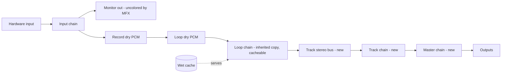

## feat: FX system v3 — Extensive

> Source brainstorm: [docs/brainstorm/2026-07-28-fx-system-v3-brainstorm-doc.md](../brainstorm/2026-07-28-fx-system-v3-brainstorm-doc.md)
> Issue: [#351](https://github.com/tomassasovsky/segno/issues/351) (retitled; supersedes the discarded Sheeran-parity experiment PR #352)
> Autonomy: `autonomy:plan-gate` — direction approved in-session (capture model, four stages, pedal mode shape, expression path); this plan is the review artifact.
> Build convention: split each part below into its own `-part-N-plan.md` before `/build`ing it; `/build` targets a part, never this index. Once a part file exists it is canonical — the index's bullets are source material to lift, not a second copy to maintain. Each part gets its own child issue with `stage:*`/`autonomy:*` labels (part 8 and part 5's physical slice `blocked-verify`); every part checks the cspell dictionary (stomp/plog/FS-6/TRS vocabulary) + semantic PR title before opening its PR.
> Review provenance: user-flow analysis (findings tagged [A#]/[B#]) + a 4-dimension
> adversarial review (32 agents; 29 confirmed findings, tagged [R#]) — all
> incorporated below as explicit decisions or tasks.

> **Note:** This plan has been split into parts. See the `-part-N` files in
> this directory. `/build` targets a part file, never this index.
> **Session setup + live status:** [execution guide](2026-07-28-feat-fx-system-v3-execution-guide.md)
> — per-part model/effort/autonomy and the status table every session updates.
>
> | Part | Scope | Depends on |
> |------|-------|------------|
> | [0](2026-07-28-feat-fx-system-v3-part-0-plan.md) | arm() fix for existing chains (standalone bug fix) | — |
> | [1a](2026-07-28-feat-fx-system-v3-part-1a-plan.md) | universal enable + ramp (lane/monitor) | — |
> | [1b](2026-07-28-feat-fx-system-v3-part-1b-plan.md) | track bus + master insert | 1a |
> | [2](2026-07-28-feat-fx-system-v3-part-2-plan.md) | loop-stage wet cache | 1a, 1b |
> | [3a](2026-07-28-feat-fx-system-v3-part-3a-plan.md) | FxAddress/slotIds/envelope/inheritance + CI jobs | 1a, 1b |
> | [3b](2026-07-28-feat-fx-system-v3-part-3b-plan.md) | session v5 migration + manifest stages | 3a, 0 |
> | [4a](2026-07-28-feat-fx-system-v3-part-4a-plan.md) | delete dead FX code | — |
> | [4b](2026-07-28-feat-fx-system-v3-part-4b-plan.md) | four-stage Signal surface | 3a, 4a |
> | [5a](2026-07-28-feat-fx-system-v3-part-5a-plan.md) | protocol v3 wire + version discovery | — (#331 prereq) |
> | [5b](2026-07-28-feat-fx-system-v3-part-5b-plan.md) | FX interaction mode (app) | 5a, 3a, 1a |
> | [6a](2026-07-28-feat-fx-system-v3-part-6a-plan.md) | faceplate presentational extraction | — |
> | [6b](2026-07-28-feat-fx-system-v3-part-6b-plan.md) | remap bindings + momentary + assignment | 6a, 5b, 3a |
> | [7](2026-07-28-feat-fx-system-v3-part-7-plan.md) | expression + external MIDI | 3a, 6b |
> | [8](2026-07-28-feat-fx-system-v3-part-8-plan.md) | TRS jack hardware (child issue, non-gating) | 7 |
> | [9](2026-07-28-feat-fx-system-v3-part-9-plan.md) | hardening + export + soak | all |
>
> Parts 2 and 3a can proceed in parallel after 1b; 0, 4a, 5a, 6a have no
> in-epic dependencies and can land any time.

## Overview

Redesign Segno's FX system around four first-class stages with everything
editable forever and hardware-class CPU in the steady state:

- **Stages:** Input (live, feeds recording) → Loop (per loop slot; inherited
  from the input chain at record) → Track (new engine insert, all loops of a
  track) → Master (new engine insert, whole mix).
- **Capture:** always dry; recording *inherits* the input chain onto the loop
  — a **by-value copy with provenance**, never a live link [A6][R13]:
  editing the input chain later never alters recorded takes.
- **Auto-cache:** the Loop stage renders its wet result in the background and
  plays the cache at zero FX CPU; any edit falls back to live processing
  instantly and re-renders. "When in doubt, play live."
- **Universal bypass:** per-effect + per-chain `enabled`, atomic and
  click-free, uniform for built-ins and plugins — the keystone for pedal
  stomps.
- **Pedal FX mode:** third interaction mode (REC → MUTE → FX). Zero-config
  contextual layout (track buttons toggle Track chains, LEDs mirror state) +
  optional per-session remap with toggle/momentary behavior. Pedal protocol
  v3 (widened mode field + on-pedal mode indicator [A1]); chain-state LEDs
  need **no wire growth** — they ride the existing trackLeds projection
  app-side [R8].
- **Expression:** USB-MIDI mapping first — continuous CC → parameters *and*
  discrete on/off CC → toggle/momentary bindings [A10] — via the revived
  `controller_repository` layer + MIDI-learn UI, LO/HI ranges; stereo TRS
  jack on the Pro Micro later (expression pedal or FS-6-style dual
  footswitch; requires PCB rework, see part 8 [R7]).

## Problem Statement

1. **No bypass exists.** The only "off" for a built-in effect is deleting it
   (its parameters are lost). `fx_apply_chain` processes every slot
   unconditionally (`packages/segno_engine/src/core/engine_fx.c:983-994`);
   `le_fx_state` has no enabled flag. Pedal FX toggling is impossible today.
2. **"Track FX" is a fiction — and there is no track bus at all.** Chains
   exist per-input (monitor) and per-lane only (`engine_private.h:230-283`);
   each lane routes *individually* into the interleaved output via its own
   `a_output_mask` (`engine_process.c:3439-3441`) — "all loops of a track"
   never exist as one stereo pair anywhere in the code [R0]. Master is gain +
   limiter only (`engine_process.c:2407-2450`).
3. **CPU never amortizes.** Every playing lane runs its full chain per sample
   forever — the price of (correct) dry capture, never optimized.
4. **Pedal is two-mode and hard-wired.** `InteractionMode` = record | mute
   (`lib/looper/model/interaction_mode.dart:8-36`); the wire protocol carries
   the mode as bit 0 of the flags byte and the flags byte is full
   (`pedal_codec.dart:28-36`). Buttons dispatch through a hard-wired switch
   (`control_cubit.dart:575-599`). There is **no version handshake** on the
   wire today [R6].
5. **Continuous control doesn't exist.** The mapping layer
   (`controller_repository`) is press-only, discards CC values, has no UI
   callers, and no persistence of any kind (`controller_repository.dart:66-89`,
   `controller_mapping.dart:82-90`) [R19]. No expression path anywhere.
6. **Known gap ridden along:** `PerformanceRepository.arm()` is never given
   real chains, so exported wet stems ≡ dry stems and DAW device chains are
   empty (`performance_repository.dart:133-135`, all call sites pass
   nothing).

## Signal model



Processing order per frame: lane PCM → **Loop chain** (or cache) → **track
stereo bus** → **Track chain** → **Master chain** → master gain → limiter →
monitors summed **after** the master chain → out. Decisions pinned in part 1
[R0]:

- **D-MASTER:** the master chain colors the track mix only; live monitor
  signals are summed after it and stay uncolored (matches the diagram; keeps
  live-through sound predictable). A native test pins this.
- **D-TRACKROUTE:** when a track's chain is **empty** (the default and the
  migration state), the per-lane routing path is **bit-identical to today**
  (preserves the migration fingerprint invariant). When a track chain is
  non-empty, its audible lanes sum into a stereo bus, the chain runs once,
  and the wet result routes via the **union of the lanes' enabled output
  masks** — a documented behavior change that only occurs when the user adds
  track FX to a divergent-mask config.
- **D-MASTERCH:** FX kernels are strict stereo; for `ch_out != 2` the master
  chain processes the first enabled output pair and passes other channels
  dry; `ch_out == 1` processes mono as l == r.

## Cross-cutting data-model decisions

- **Stable effect identity [A9]:** every chain entry gets a stable per-slot
  id (generated at insert, persisted, never reused within a session). Pedal
  bindings (part 6) and expression mappings (part 7) reference
  `{FxAddress-of-chain, slotId}`; effect-level bindings go inert (never
  retarget) when the id is gone. Lands in part 3.
- **Chain wire envelope [R13][R15]:** the chain wire format becomes an
  envelope `{chainEnabled, meta (inherited provenance), entries: [...]}`;
  `decodeTrackEffects` accepts the legacy bare array (chainEnabled = true,
  no meta). One codec everywhere — sessions (`SessionLaneChain.encoded`
  stays opaque, unchanged), settings keys, clear-restore snapshots, and the
  new track/master stages reuse the same string format.
- **Canonical `FxAddress` JSON serialization** is declared once in part 3;
  parts 6 and 7 reference it [R19].
- **Type ownership + dependency arrows [VGV-critical]:**
  `FxAddress` (and slotIds) live in **`looper_repository`** (domain model).
  Binding/mapping **targets cross the `controller_repository` /
  `pedal_repository` boundary as canonical-JSON strings** — those packages
  gain no looper/engine dependency; the **typed sealed target + resolution
  live app-side next to `ControlCubit`** (`lib/control/`), which is also the
  single dispatch point for discrete-CC toggle/momentary interpretation (no
  second control-surface interpreter grows in a repository package). The
  **chain envelope is owned by `looper_repository`**, wrapping
  `segno_engine`'s existing entries codec — the engine never consumes
  provenance/meta. Direct engine-codec call sites that migrate to the
  envelope: `lib/app/audio_bootstrap.dart:291`,
  `lib/app/monitor_migration.dart:162`,
  `lib/audio_setup/cubit/monitor_cubit.dart:84`,
  `lib/session/session_mapping.dart:47,57`.
- **State ownership for the new stages [VGV]:** `LooperBloc` owns Track and
  Master chain state (events + push, like lane chains today);
  `MonitorCubit` stays input-only.

## Technical Approach

### Part 1 — Engine: universal bypass + track bus + Track/Master inserts

The foundation everything else stands on.

- [ ] `le_fx_state`/owner structs: per-slot `_Atomic int32_t a_fx_enabled[LE_FX_MAX]`
      (default 1) + per-chain `_Atomic int32_t a_fx_chain_enabled` on lane,
      monitor, track, master owners (`engine_private.h`)
- [ ] **Track stereo bus + insert** [R0]: per-track stereo accumulator in
      `mix_tracks_frame`; D-TRACKROUTE semantics exactly as pinned above,
      including the empty-chain bit-identical guarantee (native test)
- [ ] **Master insert** [R0]: between `mix_tracks_frame` and
      `mix_monitors_frame`, before master gain/limiter; D-MASTER (monitors
      uncolored) and D-MASTERCH (channel mapping) pinned by native tests
- [ ] Heap allocations (delay rings etc.) for the new owners stay on the
      control thread per the existing contract
- [ ] Click-free engage: per-slot dry/wet crossfade ramp (~5 ms) driven by the
      enabled flag transition inside `fx_apply_chain` (`engine_fx.c`); DSP
      state reset on re-enable via existing `le_fx_entry_reset`.
      **Documented behavior: no tail spill on bypass** [B7]
- [ ] API + ring commands: `le_engine_set_{lane,monitor,track,master}_fx_enabled`,
      `..._fx_chain_enabled`, plus full track/master chain setters mirroring
      the lane set (`segno_engine_api.h`, `engine_commands.c`); enabled flips
      use direct atomic stores (like params — no heap pointers move, so no
      ring needed) so they work while stopped
- [ ] **Performance event log** [R3]: mirror the params pattern — push
      `LE_PLOG_SET_LANE_FX_ENABLED` / `LE_PLOG_SET_LANE_FX_CHAIN_ENABLED`
      (+ monitor twins) via `le_plog_push_ctrl`; update the
      `docs/design/performance-event-log-format.md` audit table with a
      verdict row for every new command (track/master setters are
      manifest-only per part 9's stems decision — "No replay" with
      rationale); replay the new codes in `perf_render`'s per-frame switch
      (its `fx_apply_chain` call gains the enabled arg regardless)
- [ ] Per-buffer snapshot reads the flags (`snapshot_track_fx` /
      `snapshot_monitor_fx` pattern); `has_fx` gating unchanged
- [ ] Chain fingerprint folds enabled bits (`engine_snapshot.c:102-138`;
      per-lane/monitor fingerprint APIs already exist) — **and the Dart
      mirror `trackChainFingerprint` updates in the same PR** folding the
      default enabled=1 until part 3 carries the field, keeping
      `fx_fingerprint_agreement_test.dart` green [R4][R16]
- [ ] Rename `snapshot_track_fx` → `snapshot_lane_fx` while the file churns:
      it snapshots per-LANE chains, and part 1 introduces a real track-stage
      chain — "track_fx" must not mean two things in one file [VGV]
- [ ] ffigen regen + `dart format` (known churn gotcha), Dart bindings
- [ ] Native tests (`test_engine_core.c`): toggle mid-tone has no
      discontinuity above ramp spec; disabled slot is bit-exact passthrough;
      no tail spill on bypass; empty-track-chain path bit-identical to
      pre-part-1 output; track-bus routing union rule; master channel
      mapping + monitor-uncolored; re-enable resets DSP state; defaults on
      old sessions

Exit: `bash packages/segno_engine/src/test/run_native_tests.sh` green. Effort: L.

### Part 2 — Engine: Loop-stage wet cache

- [ ] **Content revision counter** [R1]: per-track `_Atomic uint32_t
      a_audio_rev`, bumped in lockstep with `a_live` swaps and content
      writes, with an **audited bump-site table spanning both threads**:
      record finalize, entry into OVERDUBBING + each retired overdub pass,
      undo/redo swap, redo-from-empty, clear + clear-restore (#219), session
      load. The pool slot index can never key the cache (slots recycle,
      `engine_private.h:95-100`)
- [ ] **Volume is part of the wet recipe** [R1]: lane volume applies
      PRE-chain (`engine_process.c:3432`) and drive/octaver are nonlinear —
      **D-VOL: fold `a_vol_bits` into the cache key**, with the render
      debounce extended to volume moves. (Future refinement, not v3:
      unity-render + post-volume for linear-only chains)
- [ ] **Worker threading contract** [R2] — `perf_render` reads only a
      finalized on-disk capture; the cache renderer does NOT get that for
      free, so: (a) dry-PCM handoff = control thread copies the lane's dry
      PCM into a worker-owned buffer at enqueue time, only while the track
      is not RECORDING/OVERDUBBING, tagged with `a_audio_rev`; a finished
      render is discarded if the revision moved (copies count against the
      memory cap); (b) wet-buffer publication mirrors the `fx->plugin[]`
      discipline — control-allocated, fully written, published as one atomic
      pointer + key the audio thread loads per buffer; (c) reclamation uses
      the `engine_plugin.c` clear-slot pattern (retract → two
      processed-buffer boundaries via `a_frames` → free); (d) worker joined
      in `le_engine_stop/configure/destroy` **before** any pool or
      wet-buffer free; ASan destroy-during-active-render test
- [ ] Single worker, playing-lanes-first priority [B6]; engine DSP reused
      verbatim on a heap `le_fx_state` per render (the `perf_render`
      pattern); render-twice-keep-second for loop-wrapping tails
- [ ] Cache entries are **stereo** (chains decorrelate; memory accounting =
      2× frames) [R5]; keyed by {`a_audio_rev`, chain fingerprint incl.
      params + enabled bits + `a_vol_bits`}. **Keep both entries of a
      toggled pair** so stomping off/on is cache-hot [B2]
- [ ] **Render-debounce**: no render scheduled until the chain is stable for
      a settle window (~250 ms); continuously-moving bound params/volume
      suppress scheduling until they settle [B2][B3]
- [ ] Swap-in at the loop boundary; invalidation → immediate live fallback
      (same frame). **Documented: fallback resets DSP state, tails drop at
      the edit instant** — accepted + listen-checked [B4]. Mute during
      cached playback routes nothing; unmute stays cached (tails are part of
      the periodic render — small documented difference from live) [R5]
- [ ] Mid-render invalidation: discard unless key still matches at
      completion; worker aborts on `a_audio_rev` bump [B5]
- [ ] **Plugin-bearing chains are never cached** (offline render passes
      plugins dry); telemetry states why
- [ ] Memory cap + LRU eviction (evicted = live processing); cap
      configurable, appliance-tuned
- [ ] Snapshot telemetry: per-lane cache state (live | cached | rendering |
      failed-retrying | gave-up) — **log/test-only in v3** (debug glyph:
      part 9 [R27])
- [ ] ffigen regen + `dart format` for the new native surface (cache cap,
      telemetry) — per-part bullet so it survives the split [VGV]
- [ ] Native tests: cached ≈ live within float tolerance per built-in;
      volume move invalidates; param edit → fallback within one buffer;
      boundary swap continuity; **overdub invalidates and never plays stale
      audio** [A7]; toggle round-trip is cache-hot [B2]; eviction; plugin
      exclusion; invalidation storm

Exit: native suite green; A/B listen note on desktop. Effort: L.

### Part 3 — Domain + session + performance-arm fix

- [ ] Stage-addressed model: `FxAddress {stage, index, lane?}` + canonical
      JSON serialization (declared here, referenced by parts 6–7 [R19]) +
      **stable slotIds** [A9]; `TrackEffect` gains `enabled` + `slotId` in
      BOTH hierarchies, threaded through the boundary mappers
      (`_trackEffectToEngine` / `_trackEffectFromEngine`) and
      `copyWith/props/toJson` — the mappers are named explicitly because
      object-pattern churn won't flag them [R16]; `trackChainFingerprint`
      switches to the real per-effect bit + agreement test with mixed
      enabled/disabled chains [R16]
- [ ] **Chain envelope schema** (cross-cutting decision): implement
      `{chainEnabled, meta, entries}` with legacy bare-array decode;
      clear-restore snapshots (`_snapshotForClearRestore` /
      `_restoreClearedTake`) carry the chain flag; migration defaults every
      level to enabled [R15]
- [ ] **Inheritance = by-value copy with provenance** [A6][R13]: record()
      copies the input chain onto the loop chain exactly as today (plugin
      state frozen via `_capturePluginForLane`), stamps `inheritedFrom` in
      the envelope meta; part 4's detach clears the marker only; nothing
      ever propagates to existing takes. Tests: edit input chain post-record
      → take chain byte-identical; marker survives save/load
- [ ] **Inheritance × enabled** [R18]: per-slot `enabled` copies by value
      (disabled entries inherit disabled — the take reproduces the monitored
      sound). **D-CHAINDIS: a chain-disabled monitor chain is treated as
      dry** — the existing empty-chain bail extends to chain-disabled, the
      lane keeps its prior chain. Update the D2 doc comment
      (`looper_repository.dart:829-843`); tests for both disabled shapes
- [ ] **Overdub never re-inherits** [A7]: documented; domain exposes "input
      chain ≠ loop chain" during overdub for part 4's hint
- [ ] **Multi-input inheritance** [A8]: loop inherits from its routed input;
      multi-input mixes concatenate in input order, provenance lists all
- [ ] `looper_repository`: four-stage chain APIs + enabled setters; caches +
      re-apply-on-restart extended to track/master
- [ ] **Session leftover reset extends to new stages** [R17]: `SessionRig`
      gains `trackEffects` + `masterEffects` + per-chain enabled flags for
      every stage; capture/`rigFromBundle`/`chainsFromLooper` include them;
      `applySession` resets every remembered track/master chain and every
      chain flag the rig doesn't define; F2-style leftover test (session A
      with track+master FX → load session B without → engine + caches clean)
- [ ] Session formatVersion 4 → 5 (presence-keyed migration, matching
      `Session.fromJson`): monitor chains → Input stage, lane chains → Loop
      stage, enabled true + fresh slotIds; track/master empty; round-trips;
      fingerprint-identical load; save→load→save idempotent [flow SC-6]
- [ ] Settings persistence: new stages ride the same envelope string; no new
      per-flag keys needed [R15]
- [ ] **Fix `PerformanceRepository.arm()`** [R14]: add
      `performanceChainsFromLooper(...)` (beside `chainsFromLooper` in
      `lib/session/session_mapping.dart`) building `PerformanceChains`
      directly (domain → engine effects via the existing per-effect
      delegation; monitors from `allMonitors()`); give `LooperRepository` a
      limiter state cache + getter (today hard-coded `{true, 0.99}` at the
      `setLimiter` call — engine surface is write-only, snapshot read-back
      is not an option), re-applied on `startEngine`; wire both call sites
      (`lib/performance/cubit/performance_recorder_cubit.dart:201`,
      `lib/control/cubit/control_cubit.dart:653`)
- [ ] **PerformanceChains + armSnapshot gain track/master fields + a
      presence-keyed version marker** [R20]; arm manifest carries enabled
      bits so `le_pr_fx_chain_init_from_lane` seeds arm-time state [R3]
      (part 9 keeps only the `daw_export` reader side — cross-referenced)
- [ ] Bloc events for the new stages in `LooperBloc` (owns Track + Master
      chain state per the ownership decision; `MonitorCubit` stays
      input-only) [VGV]
- [ ] Rename `trackChainFingerprint` → `fxChainFingerprint` while both
      hierarchies churn (it becomes four-stage generic) [VGV]
- [ ] **CI gate fix [VGV-critical]**: the package suites this plan uses as
      merge gates (`looper_repository`, `session_repository`,
      `performance_repository`, `pedal_repository`,
      `controller_repository`) have **no CI jobs today** — only the root app
      job and `daw_export` run. Add per-package `flutter_package.yml` jobs
      (or one matrix job) with deliberate `min_coverage`, landing with the
      first Dart part so every later part is genuinely CI-gated

Exit: repo + migration + arm tests green. Effort: L.

### Part 4 — UI: the Signal page becomes the four-stage surface

- [ ] **D-OVERVIEW [R21]: no new page.** The Signal page's existing panes
      *are* the stage layout: Input chains stay on input cards; the Loop
      stage lives in the tracks pane grouped by track (only tracks with
      recorded loops; non-empty lanes by default, "all lanes" expander
      [A11]); **Track chains get an FX summary row on each track group
      header**; **Master gets a strip row in the outputs pane**. All editing
      stays in the single `FxDock` via **one stage-parameterized
      `StageFxScope`** for the two new stages (stage is data in `FxAddress`,
      not a type; fold the existing input/lane scopes in only if trivially
      cheap) [simplicity]. Console path: tray → Signal (no new tray tile)
- [ ] **D-POWER [R23]: one power control per card.** The universal per-slot
      enable replaces `_BypassToggle`; the plugin's own bypass param is
      hidden from the header (still reachable in the plugin's native
      editor; it is part of the plugin's sound and never drives host
      enable). Fallout tasked: `${keyPrefix}_bypass` key + tests →
      enable-toggle key; `signalPluginBypassTooltip` retired/repurposed in
      both ARBs; `FxScope` gains `setEffectEnabled` / `setChainEnabled`
      across all four scopes and its "no bypass" doc comment updates
- [ ] Chain-level enable in the dock header; per-card enable toggles;
      plain-language consequence lines per stage
- [ ] **Disabled-state rendering** [R26]: disabled cards dim via
      `SurfaceTheme` tokens (no ad-hoc opacity constants [VGV]; headers stay
      interactive); placeholder cards
      (D-MISS/loading) keep their warning state visually dominant; summary
      chips dim per-effect and strike/dim wholesale when the chain is
      disabled; Track/Master stages get the same add-FX empty affordance as
      input/lane cards
- [ ] Inherited badge on loop chains; badge clears on divergence; "re-sync
      from input" action [A6]; overdub mismatch hint [A7]
- [ ] Plugin unavailable/loading/unsupported badges surface in the stage
      overview [flow err-1]
- [ ] Delete dead FX code: `fx_inspector.dart`, `fx_chain_strip.dart`,
      `fx_param_control.dart`, `effect_params_editor.dart`, dead
      `routing_graph` effect widgets (+ tests, orphaned l10n keys; keep
      `fxBlockName`)
- [ ] l10n (both ARBs), a11y semantics on toggles, widget tests, screenshot
      goldens regen + eyeball (author-only runner)

Exit: app Dart suite green; goldens updated. Effort: L.

### Part 5 — Pedal protocol v3 + FX mode (contextual)

**Protocol v3 (wire) — scoped to the mode field + mode indicator only [R8]:**

- [ ] Widen the state-frame mode field to 2 bits (layout decided against the
      real frame in `pedal_codec.dart:28-36`); **no other wire growth** —
      FX-mode chain-state LEDs are produced app-side by `projectFrame`
      writing into the existing all-8-track `trackLeds` bytes (a new
      `PedalTrackLed` color costs zero wire bytes; firmware track-LED
      rendering stays verbatim, no mode branch in either tree) [R8][A3]
- [ ] **On-pedal mode indicator** [A1]: MODE LED tri-state (rec/mute/fx) +
      mode fold into the ring color scheme; pays the 2026-06-14 "Mode LED
      not driven yet" debt. Simulator renders the same indicator
- [ ] **Version discovery** [R6]: there is no handshake today. Source =
      the identity-reply firmware version from #331 part B (inbound seam
      grows a SysEx-capable path); until #331 ships, a manual "pedal
      firmware version" setting drives `encodeFrame`'s target version.
      **Unknown version ⇒ encode v2, never v3.** #331 is promoted to a
      prerequisite — including its sync of the drifted 32u4 protocol copy
      (currently v1-only), without which even today's v2 frames dark the
      physical pedal
- [ ] **v2/v1 projection** [B10]: with an older pedal, FX mode still enters
      — the frame projects mode=mute and trackLeds carry chain-enabled
      state (same projection code path as v3, only the mode-field downgrade
      differs [R8]); app shows "pedal firmware update available" wired to
      the #331 OTA flow [flow err-4]
- [ ] Contract-test hygiene [R9][R10][R11]: create
      `firmware/test/run_tests.sh` wrapping the documented gcc line (used by
      CI and the success criteria); CI diff-gates the two
      `pedal_protocol.{h,c}` copies (or compiles the contract test against
      both); regenerate v3 golden `.syx` fixtures (incl. an fx-mode frame);
      extend `test_version_pairings` to the full v1/v2/v3 matrix in both C
      and Dart suites [flow SC-8]; update frame-size doc constants +
      `PEDAL_FRAME_MAX_BYTES` headroom note

**FX mode (app):**

- [ ] `InteractionMode.fx`; `toggleMode()` two-value ternary → three-way
      cycle; persisted-token shim extended; **fx excluded from the
      boot-default mode setting** (booting into FX with no chains is a dead
      surface); on-screen mode chip / faceplate / settings picker updates +
      widget tests [R12]
- [ ] **Mode-cycle side effects fire on the landed mode only** [A5];
      entering FX mode while recording finalizes the recording (explicit,
      tested). MODE long-press stays performance-record arm
- [ ] **All 10 buttons defined in FX mode** [A2][A4]: Track 1–4 toggle the
      active bank's tracks' Track chains (bank-aware [A3]); Bank switches
      banks; Rec/Play **inert, reserved** ("focused track" idea dropped —
      focus is invisible on the pedal [A4]); Stop = **FX panic** (all Track
      chains off; long-press = all back on); Undo **inert until #219**;
      Clear **inert** (a stray stomp must never erase the set); Mode
      cycles; encoder = master gain
- [ ] `ControlCubit` FX-mode branches at the three switch sites + `_onPress`
- [ ] **Button-matrix `bloc_test`s** [VGV]: explicit negative tests that
      Clear, Rec/Play, and Undo are inert in FX mode (safety claims need
      proof), plus Stop-panic + long-press-restore and bank-aware track
      toggles
- [ ] **Keyboard + a11y parity** [R24]: digit keys 1–8 gain the FX-mode
      interpretation (toggle that track's Track chain) with
      `tracks_commands.dart` doc comment + `shortcuts_help_sheet.dart` in
      sync; `toggleMode()` announcement ternary gains an `a11yModeFx`
      string; `_ledStateLabel` labels LEDs per active mode so footswitch
      Semantics stay truthful; l10n in both ARBs is **part-wide** — incl.
      the firmware-update banner and the manual firmware-version setting
      [VGV]
- [ ] On-screen simulator + faceplate mirror all of the above
- [ ] `blocked-verify` slice: physical pedal validation checklist entry
      (#203 pattern)

Exit: contract tests green both trees; simulator demo; mode legibility test —
from LEDs alone a tester names the current mode after any MODE sequence
[flow SC-1]. Effort: L.

### Part 6 — Pedal remap + momentary

- [ ] **Faceplate extraction first** [R22]: `PedalFaceplate` is a live
      simulator (renders only when the on-screen pedal is the bound output;
      taps dispatch real presses). Extract the plate presentation
      (`_TopPlate` + `_Footswitch` + LEDs + mm-to-px layout) into a
      presentational widget taking an injected `PedalStateFrame`, `onPress`
      callback, and per-button selection state — API free of pixel params
      (mm-to-px stays internal) [VGV]; the simulator wrapper keeps
      the transport wiring. Simulator screenshot goldens regen + eyeball
- [ ] Binding model: `{(button, bank?) → target, behavior: toggle |
      momentary}`; target = chain (`FxAddress`) or effect (+ `slotId`)
      [A9]; track buttons bind per-bank, others per-button [A3]
- [ ] **MODE and Bank never remappable** [B12]; remaps override contextual
      defaults but never long-press system gestures
- [ ] Momentary: press captures prior state and enables; release restores
      captured state (last-writer semantics documented) [B1]
- [ ] **Release-all rule** [B1]: all held momentaries restore on mode exit,
      binding-set change, session load, and pedal disconnect — one
      enforcement point in `ControlCubit`
- [ ] Stale targets: mid-song = no-op + unlit LED; **assignment screen
      renders broken bindings in the established missing-target convention**
      (`_PluginPlaceholderCard` pattern: tertiary text + warning glyph,
      entry preserved) with rebind and clear actions + stale round-trip
      widget tests [R25][flow err-2]
- [ ] **Stomp/LED state chips** on chain cards/headers (pedal-bound +
      current state) land here, not part 4 — they depend on the binding
      model [R25]
- [ ] **Binding model home [VGV]**: the model (pure data, targets as
      canonical-JSON strings) lives app-side in `lib/control/`; the
      per-session set rides `Session` in `session_repository` as an opaque
      blob (the chains pattern) — never `SessionRig`
- [ ] Persistence + merge rule [A12]: a session with any bindings overrides
      the global set wholesale; else globals. Session round-trip tests
- [ ] Assignment screen l10n (both ARBs) + semantics on binding rows/picker
      [R24]
- [ ] Tests: no stuck momentary across disconnect/mode-switch/session-load
      [flow SC-2]; binding stability under slot insert/reorder [flow SC-4]

Exit: bind → stomp → correct toggle in widget tests + simulator. Effort: L
(bumped from M for the faceplate extraction [R22]).

### Part 7 — Expression + external MIDI control

- [ ] `controller_repository`: CC value passthrough with **two trigger
      shapes** [A10]: continuous CC (`ContinuousBinding {trigger, target,
      lo, hi}`, absolute 0–127) and **discrete on/off CC (threshold)
      driving toggle/momentary bindings** — same target model as part 6, so
      generic MIDI footswitches and the part-8 FS-6 work with zero extra
      plumbing
- [ ] Smoothing on the repo side (7-bit CC → ramped param); target registry:
      FX param at `{FxAddress, slotId}`, track volume/pan, master gain —
      shared sealed target type with part 6
- [ ] **Persistence decision made explicit** [R19]: expression mappings are
      **global-only in v1** (rationale: expression hardware is per-rig, not
      per-song; sessions stay portable across machines — deliberate
      divergence from part 6's per-session pedal bindings). Storage: one
      `controller.mappings` JSON blob in `settings_repository`;
      `MappingTrigger` and `ContinuousBinding` gain persisted forms (kind,
      CC id, MIDI channel, target via the part-3 canonical FxAddress form,
      lo/hi)
- [ ] **Learn hygiene** [B8]: learn ignores the Segno pedal's own protocol
      traffic (note range + relative encoder CC); fan-out (one CC → many
      targets) allowed — reference-grounded, Sheeran assigns up to 4 params
      to one expression pedal (manual 5.5.4); many CCs → one target =
      last-writer-wins
- [ ] **Discrete-CC momentary safety [VGV]**: the release-all rule [B1]
      extends to MIDI-source disconnect for momentary bindings (a held MIDI
      momentary + device unplug must release); discrete-CC toggle/momentary
      dispatches through the same `ControlCubit` enforcement point (per the
      ownership decision — no second interpreter in the repository)
- [ ] **Repository-level tests enumerated [VGV]**: both trigger shapes
      resolve; threshold semantics; smoothing ramp (timer/ticker in the repo
      → disposal + fake-clock tests); learn-ignores-pedal-traffic;
      fan-out + last-writer-wins; persistence round-trip; missing-device
      inert mapping
- [ ] **Takeover = jump-on-first-move for v1** [B9]; pickup/catch = future
- [ ] Live behavior: last-writer-wins vs UI knobs; unplug mid-song = value
      holds; missing-device session load = mapping kept, inert, row shows
      device-missing + one-tap relearn [flow err-3]
- [ ] **MIDI-learn UI fully specified** [R28]: lives as a settings-tray
      section (matching pedal/audio sections); each row = target picker +
      Learn button → "listening…" state with cancel/timeout; binding an
      already-bound CC replaces after inline confirm; LO/HI rows use
      `SignalKnob` + `signalMono`; l10n (both ARBs) + semantics + widget
      tests [R24]
- [ ] Refresh `docs/MIDI_FOOT_CONTROLLER.md` (stale today)

Exit: learn → sweep → param moves, persisted across restart. Effort: M.

### Part 8 — Hardware: stereo TRS jack on the pedal (blocked-verify)

- [ ] **Reality check first [R7]: the Pro Micro has zero free GPIO.**
      D15/D16 are the WS2812 data outputs; A2 is physically wired to the
      encoder push switch (declared but never read); A3 is the LED power
      sense. This part is **PCB rework on `main_board.py`**, not a pin
      audit. Preferred direction: **repurpose A2** (cut the ENC_SW net —
      the push switch is never read in firmware) and use a **single-pin
      resistor-ladder TRS decode on A2 alone** that distinguishes an
      expression wiper from FS-6 tip/ring switch combinations without a
      second pin. Alternatives if the ladder proves unreliable: free a pin
      by dropping DIN MIDI IN (D0), or an I/O expander / respin. Verify on
      the bench; the pinmap is user-verified — do not assume
- [ ] Firmware: ADC read + ladder decode; jack-type config (expression vs
      FS-6) as a firmware setting surfaced in app settings; values sent as
      absolute CCs on the existing cable (consumed by part 7's triggers
      [A10])
- [ ] **Mismatch safety** [B11]: wrong-accessory and mono-TS (ring shorted)
      cases produce bounded, non-destructive behavior; settings hint on
      suspected mismatch
- [ ] Hardware docs + physical validation checklist entries

Exit: physical validation on the bench. Effort: L (PCB rework acknowledged
[R7]). **Scheduling [simplicity]: tracked as its own child issue
(`blocked-verify`), dependent on — not gating — the epic's close; the epic
closes on the software-only criteria.**

### Part 9 — Hardening, export, appliance

- [ ] `daw_export` reader side for Track/Master stages ([R20]: the
      writer/model side landed in part 3): `fx_chains.txt` + manifest reader
      render the new stages; decision stands — chains in manifest, **not**
      rendered into stems (stems stay per-stage dry-of-downstream)
- [ ] **Export replay test for stomps** [R3]: toggle a loop-stage effect
      mid-capture → rendered wet stem flips at the logged frame; a slot
      disabled at arm renders bypassed
- [ ] Appliance soak: cache hit-rate + xrun budget on the Pi under a full
      8-track set; session-load render storm xrun-free, playing-lanes-first
      [B6][flow SC-7]; cap tuning; document limits
- [ ] Cache debug glyph on lane cards behind the existing debug/indicator
      toggle (kept out of the calm default UI) [R27]
- [ ] Undo/redo contract for toggles (coordinate with #219; until then undo
      stays inert in FX mode per part 5)
- [ ] `docs/PROGRESS.md` FX mental-model rewrite; release notes (migration
      behavior, overdub inheritance rule, D-TRACKROUTE divergent-mask note)

Exit: soak notes + docs merged. Effort: M.

## Alternative Approaches Considered

| Approach | Why rejected |
|----------|--------------|
| True Pre-bake (Sheeran parity, PR #352) | Discarded by owner; destructive, kills stomp-on-recorded-material, undo needs dry shadows |
| Plain always-dry (status quo model) | User explicitly asked for better steady-state CPU than today |
| Explicit freeze button | Same CPU win but adds a user-facing concept; cache is invisible and safer |
| Live-linked inheritance | Retroactive mutation of recorded takes violates least surprise (D3); copy-with-provenance keeps the visible relationship [A6][R13] |
| Positional-only FxAddress for bindings | Reorder/delete silently retargets stomps; stable slotIds required [A9] |
| Chain-enabled bits as new wire-frame fields | Wire growth + mode-conditional firmware LED logic in both trees; the existing trackLeds projection carries it app-side for free [R8] |
| Unity-render + post-cache volume | Audibly changes drive/octaver character vs live; folding volume into the key + debounce keeps cached ≡ live exactly [R1] |
| Extend `LooperAction` for the pedal FX mode | Mode-blind and bloc-scoped; the ONE control-surface interpreter principle puts FX mode in `ControlCubit` |
| "Focused track" pedal default in FX mode | Focus has no on-pedal indicator; invisible targets get mis-stomped [A4] |
| Mono TS expression jack | User requires stereo TRS for FS-6-class accessories |
| Second GPIO for the TRS ring | No free pin exists on the board; single-pin resistor ladder on a repurposed A2 [R7] |

## Success Criteria

```success-criteria
GOAL: Four-stage editable FX with baked-class steady-state CPU, pedal FX mode, and expression mapping — nothing destructive anywhere.

SUCCESS CRITERIA:
- Engine bypass + track bus + inserts: no-tail-spill, ramp continuity, empty-chain bit-identity, D-MASTER/D-TRACKROUTE/D-MASTERCH pinned, plog events (part 1) | verify: bash packages/segno_engine/src/test/run_native_tests.sh
- Wet cache: correctness incl. volume-in-key, revision bump audit, threading lifecycle under ASan, cache-hot toggle round-trip, storm safety (part 2) | verify: bash packages/segno_engine/src/test/run_native_tests.sh
- Domain/session: migration fidelity, envelope back-compat, leftover reset incl. new stages, arm fix end-to-end (part 3) | verify: /Users/Tomas/development/flutter/bin/flutter test packages/looper_repository packages/session_repository packages/performance_repository test/looper test/audio_setup
- Four-stage Signal surface + single power control + dead-code removal (part 4) | verify: /Users/Tomas/development/flutter/bin/flutter test test/looper && ! ls lib/looper/view/fx_editor/fx_inspector.dart 2>/dev/null
- Protocol v3: contract tests both trees via new runner, v1/v2/v3 pairing matrix, projection + never-encode-above-negotiated (part 5) | verify: bash firmware/test/run_tests.sh && /Users/Tomas/development/flutter/bin/flutter test packages/pedal_repository
- Mode legibility from LEDs alone after any MODE sequence (part 5) | verify: /Users/Tomas/development/flutter/bin/flutter test test/pedal --name "mode indicator"
- Remap + momentary: no stuck momentary, binding stability under reorder, stale-binding UI round-trip (part 6) | verify: /Users/Tomas/development/flutter/bin/flutter test test/pedal test/control
- Expression: continuous + discrete CC triggers, learn hygiene, persistence round-trip (part 7) | verify: /Users/Tomas/development/flutter/bin/flutter test packages/controller_repository
- TRS jack (part 8) | verify: manual 1) expression pedal sweeps LO..HI 2) FS-6 fires both discrete triggers 3) jack-type switch swaps behavior 4) mono TS degrades to single switch
- Appliance soak incl. load-storm + stomp export replay (part 9) | verify: manual xrun/cache-hit report on Pi console per docs/RUNNING_ON_RPI.md
- Happy path | verify: manual 1) delay+reverb on input 2) record loop (inherits, badge shows) 3) FX mode: MODE LED shows FX color; stomp track button → track chain off, LED dark, loop audibly changes 4) hold-stomp a momentary binding, disconnect pedal mid-hold → effect releases 5) sweep mapped CC → param moves 6) delete a bound effect → stomp inert, LED dark, assignment screen flags it 7) switch modes mid-recording → recording finalizes per documented rule 8) reload session → chains, bindings, enabled states, inherited badges intact

NON-GOALS:
- Sheeran UI parity or preset packs (presets may become a later child issue)
- Caching Input/Track/Master stages or plugin-bearing chains
- VST3 distribution work (#194) and tempo/mode work (#263)
- Per-layer (undo-layer) FX; layers share the loop chain
- Toggle undo/redo in FX mode before the #219 contract
- MIDI clock, program change, pitch-bend/aftertouch; pickup/catch takeover
- Per-session expression mappings (global only in v1, stated rationale)
- Unity-render volume optimization for linear-only chains (future)

VERIFICATION COMMAND: bash packages/segno_engine/src/test/run_native_tests.sh
```

## Risk Analysis & Mitigation

| Risk | Mitigation |
|------|------------|
| Cache plays stale/wrong audio | Key = revision + fingerprint(params, enabled) + volume; audited bump-site table [R1]; "in doubt → live"; storm + overdub tests; telemetry |
| Render worker races the audio thread | Copy-at-enqueue + atomic publish + quiescent reclaim + join-before-free, ASan test [R2] |
| Cache churn under stomping / sweeps | Toggled-pair retention + settle debounce incl. volume [B2][B3][R1] |
| Track bus changes existing routing | Empty-chain path bit-identical (tested); union-mask rule only engages when track FX added [R0] |
| Stomps invisible in exports | plog enabled events + perf_render replay + part-9 flip test [R3] |
| Protocol v3 darks older pedals | No handshake today: unknown ⇒ encode v2 [R6]; #331 prerequisite incl. 32u4 sync; v1/v2/v3 pairing matrix [R11] |
| Firmware trees drift | CI diff-gate between protocol copies + shared runner script [R9][R10] |
| Stray stomps in FX mode destroy the set | Clear inert, Stop = FX panic only, undo inert; every button explicit [A2] |
| Bindings silently retarget | Stable slotIds + stability test [A9]; stale-binding UI [R25] |
| Two power toggles confuse plugin cards | Single host enable; plugin bypass param hidden [R23] |
| Migration surprises | Presence-keyed v5, envelope back-compat, fingerprint-identical load, leftover reset extended [R15][R17] |
| Part-8 pin assumptions | Zero free GPIO acknowledged; A2 repurpose + resistor ladder direction; bench-verified [R7] |
| Squash-merge landmines on stacked parts | Repo stacked-PR discipline (child rebases, per-part branches) |

## Dependencies & Prerequisites

- Existing: `fx_apply_chain` vtable DSP, `le_fx_entry_reset`, SPSC ring,
  per-buffer snapshot pattern, `perf_render.c` offline chain infra (pattern
  only — it reads finalized captures, not live state [R2]),
  `le_engine_lane_fx_fingerprint` family, dormant `controller_repository`
  learn flow, pedal state-frame + LED projection, on-screen pedal simulator
- **#331 (pedal auto-detect / firmware OTA) is a prerequisite for part 5's
  version discovery** — including its sync of the drifted (v1-only) 32u4
  protocol copy [R6]; until it ships, a manual firmware-version setting
  gates encoding
- ffigen regen + `dart format` after every native API change
- Screenshot goldens are author-machine-only — regen + eyeball in parts 4
  and 6
- Hardware phase (part 8) needs the physical board + PCB rework

## Documentation Plan

- [ ] `docs/PROGRESS.md` FX mental model rewrite (part 9)
- [ ] `docs/design/session-bundle-format.md` — already stale (documents v3,
      code writes v4); part 3 brings it to v5 with a full history section
- [ ] `docs/design/performance-event-log-format.md` audit table rows for
      every new command [R3] (part 1)
- [ ] `docs/MIDI_FOOT_CONTROLLER.md` refresh (part 7)
- [ ] Firmware protocol doc v3: mode field, mode indicator, version
      discovery, projection rules, fixture regeneration (part 5); hardware
      jack doc (part 8)
- [ ] Release notes: migration defaults, new stages, pedal mode, overdub
      inheritance rule, D-TRACKROUTE note

## References & Research

- Brainstorm: `docs/brainstorm/2026-07-28-fx-system-v3-brainstorm-doc.md`
- Code audits (this session): engine FX map, pedal/MIDI map, FX/session
  deep-dive — key files cited inline
- Flow analysis (this session): [A1–A12], [B1–B12], error states, added
  success criteria
- Adversarial review (this session): 32-agent workflow, 29 confirmed
  findings [R0–R28] — all resolved above
- Prior design docs: `2026-06-14-looper-pedal-firmware-protocol-brainstorm-doc.md`
  (Mode LED debt), `2026-07-04-fx-state-robustness-brainstorm-doc.md`
  (plugin placeholder states), `2026-07-04-named-sessions-brainstorm-doc.md`
- Reference manuals: Boss RC-600, HeadRush Looperboard 2.0, Sheeran Looper X
  1.0 (Input/Track FX, Pre/Post racks, pedal assign Toggle/Hold, expression
  LO/HI ranges)
- Related: #194 (VST3 epic), #263 (tempo/modes), #219 (undoable clear incl.
  FX), #331 (pedal auto-detect/OTA — prerequisite), #253 (LED strip
  pixels), footswitch debounce latency memory (~8 ms, separate)
