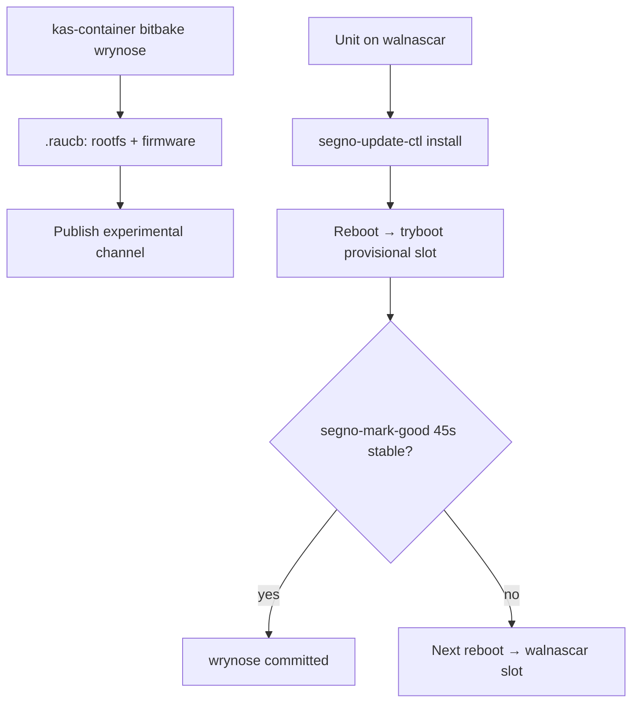

## chore: migrate appliance Yocto image to wrynose LTS - Standard

Brainstorm: [`docs/brainstorm/2026-08-31-yocto-wrynose-migration-brainstorm-doc.md`](../brainstorm/2026-08-31-yocto-wrynose-migration-brainstorm-doc.md)

## Overview

Move the shipping Segno appliance image from **Yocto 5.2 walnascar** to **Yocto 6.0 wrynose LTS** (supported until April 2030), preserving the current product: weston kiosk-shell, prebuilt Flutter GTK bundle, RAUC/tryboot A/B on **Pi 5 (NVMe)**, ALSA + PREEMPT_RT audio path.

This is a **series bump + deferred RAUC completion**, not a product redesign. The critical new capability is **boot FAT slot + rootfs in the same `.raucb`**, so walnascar units can OTA onto wrynose with a kernel whose modules match the installed rootfs.

## Problem Statement / Motivation

- **Walnascar is not LTS.** Wrynose is the current LTS line through April 2030.
- **Wrynose deprecates the poky combo-layer repo.** Upstream now expects `openembedded-core` + `bitbake` + `meta-yocto` (kas can still orchestrate this; no bitbake-setup migration in this work).
- **Rootfs-only OTA is insufficient for a kernel bump.** `system.conf` already parents `firmware.0/1` to `rootfs.0/1`, but `segno-update-bundle.bb` only bundles rootfs. Shipping wrynose userspace with a walnascar kernel on the FAT slot guarantees `/lib/modules/$(uname -r)` skew.
- **Commit pins (#465) stay.** Layer bumps remain explicit, reviewable commits — only the branch moves from `walnascar` to `wrynose`.

## Proposed Solution

### Phase 1 — kas layer stack on wrynose

Replace the poky combo-layer entry in `deploy/yocto/kas-segno-common.yml` with commit-pinned wrynose repos:

| Repo | Role |
|------|------|
| `openembedded-core` | `meta/` (was `poky/meta`) |
| `bitbake` | build engine (was inside poky) |
| `meta-yocto` | `meta-poky/` distro (was `poky/meta-poky`) |
| `meta-openembedded` | unchanged shape (`meta-oe`, `meta-python`, `meta-multimedia`, `meta-networking`) |
| `meta-raspberrypi` | Pi BSP |
| `meta-rauc` | RAUC |

Refresh SHAs with `git ls-remote <url> refs/heads/wrynose` in one reviewable commit (same convention as #465).

Update `deploy/yocto/meta-segno/conf/layer.conf`:

```bitbake
LAYERSERIES_COMPAT_segno = "wrynose"
```

Drop obsolete series (`scarthgap`, `styhead`, `walnascar`) once wrynose builds green.

**Keep kas + kas-container.** Do not migrate to bitbake-setup in this issue.

### Phase 2 — wrynose layout / API fixes in meta-segno

Work through wrynose migration-guide breakages that touch this layer:

| Area | Current | wrynose action |
|------|---------|----------------|
| WIC | `wic/segno-tryboot.wks.in` + `scripts/lib/wic/plugins/source/tryboot-partition.py` | Move under `files/wic/` per wrynose requirement; update `WKS_FILE` path |
| RAUC conf path | `recipes-core/rauc/rauc-conf.bbappend` installs to `/etc/rauc/` | Align with meta-rauc wrynose hermetic `/usr/lib/rauc/` policy; audit runtime readers |
| Weston patches | `recipes-graphics/weston/files/000{1,2}-*.patch` against weston 14 paths | Rebase or rewrite on wrynose weston; keep kiosk HPD guard (#821) |
| Kernel pin | `PREFERRED_VERSION_linux-raspberrypi = "6.12.%"` in kas | Try **6.18.%** first; keep `rt.cfg` bbappend |
| `ddcutil_git.bb` | `S = "${WORKDIR}/git"` | Migrate to `${UNPACKDIR}` pattern used elsewhere |
| systemd bbappend | documents against systemd 257.6 PACKAGECONFIG | Re-verify `coredump` / `elfutils` options on wrynose recipe |
| DISTRO_FEATURES | explicit `wayland opengl systemd pam` append | Review wrynose defaults (`wayland`, `opengl`, `vulkan`, `ptest` now default in OE-core); drop redundant appends only if image stays lean |

Document walnascar → wrynose in `deploy/yocto/README.md`. Note the Tier 3a spike plan still says scarthgap — add a pointer, do not rewrite that historical doc.

### Phase 3 — boot-in-bundle (RAUC)

**Goal:** first published wrynose `.raucb` includes **inactive-paired boot FAT + rootfs** so OTA from walnascar delivers kernel, DTB, `config.txt`, and `cmdline.txt` together with `/lib/modules`.

#### Slot model (already in tree)

`deploy/yocto/meta-segno/recipes-core/rauc/files/system.conf`:

- `firmware.0` (p2 bootA) → `parent=rootfs.0` (p5 rootA)
- `firmware.1` (p3 bootB) → `parent=rootfs.1` (p6 rootB)

`tryboot-cmdline.bbclass` rewrites each FAT slot's `cmdline.txt` `root=` to the paired ext4 partition after `do_image_wic`.

#### Bundle recipe changes (`segno-update-bundle.bb`)

1. Expand `RAUC_BUNDLE_SLOTS` beyond rootfs-only — include the firmware slot artifact(s) RAUC expects for parented vfat slots.
2. Define **`RAUC_SLOT_firmware`** (names must match `system.conf` slot names / meta-rauc bundle class conventions — verify against wrynose `meta-rauc` docs and `bundle.bbclass` during build).
3. **Artifact source:** produce a vfat image containing the boot partition contents (kernel, DTB, overlays, `config.txt`, slot-specific `cmdline.txt`) built the same way WIC's `bootimg-partition` source does today. Likely paths:
   - Reuse image deploy artifacts from `segno-kiosk-image` bootimg output, **or**
   - Add a small image/boot artifact recipe consumed by the bundle class.
4. **Invariant:** the boot image written to the inactive firmware slot must have `cmdline.txt` pointing at the inactive rootfs partition (p5 or p6) — same invariant `tryboot-cmdline.bbclass` enforces in the `.wic`.

#### CI guard (new)

Add a shell test (e.g. `deploy/yocto/meta-segno/recipes-core/images/test/run_bundle_slots_tests.sh`) that, given a built `.raucb`, asserts via `rauc info --no-verify` (or manifest parse) that **both** rootfs and firmware slots are present and `compatible=segno-raspberrypi5`.

Wire into `.github/workflows/main.yaml` appliance helper suite block **if** the test can run without a full bitbake (mock manifest) or document as post-bitbake CI step in `appliance-release.yml`.

#### Publish policy

**Never publish a wrynose rootfs-only bundle** to experimental or production. First wrynose channel entry must be boot+rootfs. Experimental channel soak before production promotion.

### Phase 4 — kernel policy

1. Set `PREFERRED_VERSION_linux-raspberrypi = "6.18.%"` in `kas-segno-common.yml`.
2. Keep `linux-raspberrypi_%.bbappend` + `files/rt.cfg`.
3. **Decision tree:**
   - If wrynose 6.18 exposes `CONFIG_PREEMPT_RT` on `raspberrypi5` arm64 → ship 6.18 in bundle.
   - Else → revert pin to `6.12.%` **on wrynose** for merge; open follow-up for 6.18+RT.
4. Audio bench sign-off (`autonomy:blocked-verify`) before production: loopback/pedal path at production buffer settings with no xruns.

### Phase 5 — CI / cache / docs

**`appliance-release.yml`:**

- Kas paths unchanged (`deploy/yocto/kas-segno-rpi5.yml`).
- Cache key `hashFiles('deploy/yocto/**')` will miss on first wrynose merge → expect cold build (~2 h).
- **Self-hosted runner (#817):** use a **namespaced** work dir for wrynose cold sstate (e.g. `.../yocto-wrynose/`) or wipe walnascar sstate before first wrynose build — do not let both series share one unbounded tree on a tight LVM pool.
- After bitbake, add bundle slot inspection step before publish (Phase 3 CI guard).
- Keep 40 GB pre-flight disk gate.

**Flutter bundle:** unchanged Ubuntu 24.04 arm64 build (`deploy/rpi/build/build-arm64-bundle.sh`). Run `packages/segno_engine/tool/check_ffi_symbols.sh` on staged bundle before Yocto as today.

**Scope exclusions:** Pi 4 publish path unchanged (buildable, not published); no display-stack swap (#897); no EEPROM self-provision (#826); no Flutter host OS bump.

## Technical Considerations

### OTA flow (walnascar → wrynose)



**Rollback:** tryboot + `segno-mark-good` unchanged. Failed wrynose boot returns to committed walnascar slot on next reboot.

**Retry after rollback:** document behavior — if ctl re-downloads the same failed version every poll, add failure backoff or require manifest version bump before retry (verify during build against `run_reconcile_staged_tests.sh` semantics).

**mark-good timing:** wrynose first boot may be slower (Weston, Flutter, WiFi). If bench shows false rollback, temporarily widen `SEGNO_MARK_GOOD_*` for migration only — hardware decision.

### ABI / runtime risks

- **GLib/GTK:** scarthgap failed on `g_once_init_enter_pointer` (GLib 2.80 vs 2.78). Walnascar fixed it. Wrynose may move userspace again — BitBake green ≠ app loads.
- **Weston patches:** build-time failure likely before any OTA.
- **RAUC path:** wrynose meta-rauc hermetic `/usr/lib/rauc/` may affect keyring + system.conf install paths.

### Compatible string

Keep `segno-raspberrypi5` so walnascar units accept wrynose bundles. RAUC compatible is per-board, not per-series — intentional. Mitigate fleet risk with **experimental-only soak** before production tag.

## Success Criteria

```success-criteria
GOAL: The shipping Pi 5 appliance builds on Yocto 6.0 wrynose LTS, publishes a RAUC bundle that includes boot FAT + rootfs slots, and can OTA from walnascar onto wrynose on bench hardware with working rollback.

SUCCESS CRITERIA:
- meta-segno declares wrynose layer compatibility | verify: grep -q 'wrynose' deploy/yocto/meta-segno/conf/layer.conf
- kas common config pins wrynose repos (not walnascar branch) | verify: grep -q 'branch: wrynose' deploy/yocto/kas-segno-common.yml && ! grep -q 'branch: walnascar' deploy/yocto/kas-segno-common.yml
- kas common config uses split OE-core + bitbake + meta-yocto (no poky combo url as sole core) | verify: grep -q 'openembedded-core' deploy/yocto/kas-segno-common.yml && grep -q 'bitbake' deploy/yocto/kas-segno-common.yml && grep -q 'meta-yocto' deploy/yocto/kas-segno-common.yml
- WIC layout lives under files/wic per wrynose | verify: test -f deploy/yocto/meta-segno/files/wic/segno-tryboot.wks.in
- Existing appliance shell test suites pass | verify: bash deploy/yocto/meta-segno/recipes-segno/segno-bundle/test/run_mark_good_tests.sh && bash deploy/yocto/meta-segno/recipes-segno/segno-bundle/test/run_reconcile_staged_tests.sh && bash deploy/yocto/meta-segno/recipes-graphics/weston-init/test/run_weston_log_tests.sh
- Bundle recipe declares more than rootfs-only slots | verify: grep -E 'RAUC_BUNDLE_SLOTS.*firmware|RAUC_SLOT_firmware' deploy/yocto/meta-segno/recipes-core/images/segno-update-bundle.bb
- deploy/yocto/README documents wrynose as the pinned series | verify: grep -qi wrynose deploy/yocto/README.md
- wrynose image + bundle bitbake green on rpi5 kas project | verify: manual 1. Stage prebuilt bundle per deploy/yocto/README.md 2. kas-container build deploy/yocto/kas-segno-rpi5.yml (or appliance-release workflow_dispatch board=rpi5 publish=no) 3. Confirm segno-update-bundle and segno-kiosk-image artifacts exist
- Published .raucb contains rootfs + firmware slots and compatible segno-raspberrypi5 | verify: manual 1. rauc info --no-verify <built.raucb> 2. Confirm slot list includes firmware + rootfs and compatible matches segno-raspberrypi5
- walnascar unit OTA to wrynose succeeds with UI up and mark-good committed | verify: manual 1. Pi 5 on walnascar experimental/production-ish build 2. Install experimental wrynose .raucb via segno-update-ctl 3. Reboot 4. Confirm uname -r matches /lib/modules/$(uname -r) 5. Confirm segno UI renders 6. Confirm rauc status shows booted slot good
- Failed wrynose OTA rolls back to walnascar on next reboot | verify: manual 1. After wrynose install + reboot, kill segno before mark-good window 2. Reboot again 3. Confirm walnascar build-version and booted slot
- PREEMPT_RT audio path acceptable on wrynose kernel (6.18 or 6.12 fallback) | verify: manual 1. Loopback or pedal audio at production buffer settings 2. No sustained xruns during representative playing

NON-GOALS:
- Migrating from kas to bitbake-setup
- Display-stack evaluation (weston vs labwc vs no compositor — #897)
- Pi 4 image publishing or new RAUC compatible strings
- Flutter bundle host OS change (stay Ubuntu 24.04 prebuilt)
- EEPROM self-provision in image (#826)
- Changing RAUC compatible string to encode Yocto series

VERIFICATION COMMAND: grep -q 'wrynose' deploy/yocto/meta-segno/conf/layer.conf && grep -q 'branch: wrynose' deploy/yocto/kas-segno-common.yml && ! grep -q 'branch: walnascar' deploy/yocto/kas-segno-common.yml && grep -q 'openembedded-core' deploy/yocto/kas-segno-common.yml && grep -q 'bitbake' deploy/yocto/kas-segno-common.yml && grep -q 'meta-yocto' deploy/yocto/kas-segno-common.yml && test -f deploy/yocto/meta-segno/files/wic/segno-tryboot.wks.in && bash deploy/yocto/meta-segno/recipes-segno/segno-bundle/test/run_mark_good_tests.sh && bash deploy/yocto/meta-segno/recipes-segno/segno-bundle/test/run_reconcile_staged_tests.sh && bash deploy/yocto/meta-segno/recipes-graphics/weston-init/test/run_weston_log_tests.sh && grep -E 'RAUC_BUNDLE_SLOTS.*firmware|RAUC_SLOT_firmware' deploy/yocto/meta-segno/recipes-core/images/segno-update-bundle.bb && grep -qi wrynose deploy/yocto/README.md
```

## Success Metrics

- CI `appliance-release` produces wrynose `.raucb` + `.wic` on rpi5 without cold-timeout on self-hosted runner (after one namespaced cold build).
- ≥1 bench Pi 5 completes walnascar → wrynose OTA on experimental channel before production tag.
- No GLib symbol crash-loop on wrynose (same class of failure as scarthgap → walnascar).

## Dependencies & Risks

| Risk | Mitigation |
|------|------------|
| Boot-in-bundle artifact pipeline undefined | Phase 3 spec + bundle slot CI test before any channel publish |
| Kernel/modules mismatch on OTA | Boot slot mandatory; verify `uname -r` vs `/lib/modules` in hardware checklist |
| Weston patch failure | Fix in same PR as series bump; blocks all artifacts |
| GLib/GTK ABI | On-device load test; keep Ubuntu 24.04 bundle until proven |
| 6.18 RT unavailable | Explicit fallback to 6.12.% on wrynose |
| Runner disk exhaustion (#817) | Namespaced wrynose cache + 40 GB gate |
| Fleet brick on first wrynose OTA | Experimental soak only; rollback path tested before production |
| meta-rauc system.conf path change | Audit bbappend + installed paths on wrynose rootfs |

## References & Research

- Brainstorm: [`docs/brainstorm/2026-08-31-yocto-wrynose-migration-brainstorm-doc.md`](../brainstorm/2026-08-31-yocto-wrynose-migration-brainstorm-doc.md)
- Current kas pins: [`deploy/yocto/kas-segno-common.yml`](../../deploy/yocto/kas-segno-common.yml)
- RAUC slot table: [`deploy/yocto/meta-segno/recipes-core/rauc/files/system.conf`](../../deploy/yocto/meta-segno/recipes-core/rauc/files/system.conf)
- Bundle recipe (rootfs-only today): [`deploy/yocto/meta-segno/recipes-core/images/segno-update-bundle.bb`](../../deploy/yocto/meta-segno/recipes-core/images/segno-update-bundle.bb)
- Commit-pin rationale: #465
- Tryboot vendored (not Koch layer): #303
- Runner disk incident: #817
- Yocto 6.0 migration guide: https://docs.yoctoproject.org/6.0/migration-guides/migration-6.0.html
- Wrynose release notes: https://docs.yoctoproject.org/current/migration-guides/release-notes-6.0.html
- meta-rauc wrynose branch + `/usr/lib/rauc` policy: https://github.com/rauc/meta-rauc
- Origin spike (historical): [`docs/plan/2026-07-23-spike-tier3a-yocto-gtk-plan.md`](2026-07-23-spike-tier3a-yocto-gtk-plan.md)

## Implementation checklist

- [ ] Phase 1: wrynose kas repos + `LAYERSERIES_COMPAT_segno`
- [ ] Phase 2: WIC move, RAUC path, weston patches, recipe cleanups
- [ ] Phase 3: boot-in-bundle recipe + CI slot test + publish guard
- [ ] Phase 4: 6.18.% kernel try + RT fallback decision
- [ ] Phase 5: CI cache namespace, README, appliance-release bundle inspect step
- [ ] Hardware: experimental OTA soak (walnascar → wrynose, rollback, audio)
