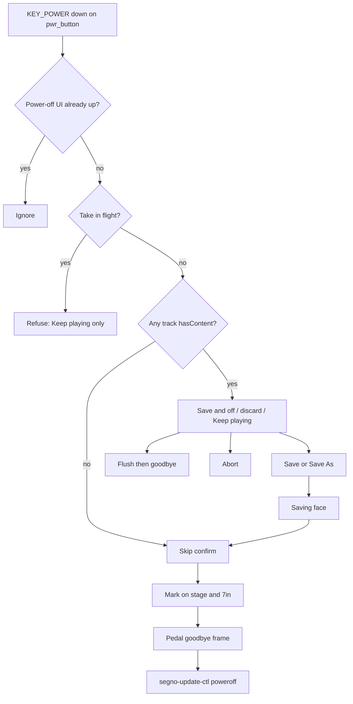

## feat: appliance power-off confirmation and goodbye - Standard

Tracking: [#959](https://github.com/tomassasovsky/segno/issues/959).
Brainstorm: [`2026-08-31-appliance-power-off-button-brainstorm-doc.md`](../brainstorm/2026-08-31-appliance-power-off-button-brainstorm-doc.md).
Hardware: console J8 → J9 → Pi 5 J2 PWR pads
([`console_board.py` J8](../../hardware/kicad/console_board.py)).
Gate: `autonomy:blocked-verify` — Flutter UI and the helper verb are
CI-provable; the J2 → `pwr_button` → halt path is not.

## Overview

A short press of the rear power button becomes a product action on the
appliance: intercept `KEY_POWER`, refuse or confirm when live work would
vanish, then a goodbye screen (Saving… if needed, then the Plymouth mark on
both displays) before a clean halt. A several-second hold stays the PMIC's
uninterceptable force-off.

Today that short press does **nothing** in userspace. The kiosk image has no
logind, so nothing consumes `KEY_POWER`. Live loops live in RAM; named
sessions write only on explicit Save. An accidental bump once something
*does* start handling the key — or a future logind — would drop a set.

## Problem Statement / Motivation

The button is already in the enclosure and the netlist. It is not a GPIO
and not `dtoverlay=gpio-shutdown`. The kernel exposes it as `gpio-keys`
`KEY_POWER` (116) on the input device named `pwr_button`
(`/dev/input/by-path/platform-pwr_button-event`). Without an app handler
there is no confirmation, no goodbye, and no flush of the 300–400 ms
debounced FX/mappings writes.

This is the musical-data half of Part 6's still-open "safe-shutdown story."
OS/SD survival is overlayfs; this slice is "don't throw away the set by
accident."

## Proposed Solution

**App owns the button.** An appliance-only evdev listener in the **main**
Flutter engine `EVIOCGRAB`s `pwr_button`, so Weston does not also forward
`XF86PowerOff`. A `PowerOffCubit` evaluates a pure `PowerOffGate` and drives
confirm → optional save → goodbye → `segno-update-ctl poweroff`.

Desktop never starts the listener. The update-restart confirm is a different
button and is **not** retargeted in this slice.



### Gate predicate (`PowerOffGate`)

Pure function of a snapshot (no cubit-calls-cubit). Tests own this file.

**Take in flight** (refuse — only Keep playing):

- any track `isCapturing` or `pending`
- `layerInFlight` (punch-tail still draining)
- count-in sounding (`TransportClockState`)
- performance cubit `Armed` / `Finalizing` / `Rendering`
- `PerformanceRecorderIdle.recovering` (boot salvage writing)

**Would vanish** (three-choice): any track `hasContent`, and not in flight.

**Nothing to lose** (skip confirm): otherwise. A named session whose tracks
are all empty still skips — the last on-disk save survives. FX-only edits
with empty tracks also skip, but the halt path still **flushes** debouncers
(H8).

Do **not** add session dirty tracking.

### Confirm UI

New dialog in the console language (`ConsoleDialogShell` / 744, same as
sessions and capture). **Do not** call `showConsoleConfirmDialog` — that
helper is two-button with a fixed "keep it" label.

- Refuse: warning (not destructive red). One action: Keep playing. Body:
  stop the take first.
- Three-choice: Keep playing (neutral) · Save & power off (accent) ·
  Power off without saving (destructive). Body says **loops in RAM** vanish
  on discard — not "unsaved session" (there is no dirty flag; a named
  session still asks).
- `useRootNavigator: true`. This is the system interrupt: it may sit above
  an already-open capture/sessions sheet; Keep playing pops **only** the
  power-off route.
- Scrim tap and pedal `ButtonPressed` on refuse / three-choice / Save As =
  Keep playing. They never mean discard. Extra `KEY_POWER` is ignored
  (locked).
- Re-check the predicate at **every commit** (Save, discard, Save As OK).
  If a take is now in flight, discard/save do not run; morph to refuse.
  While the power-off route is current, ignore Rec / overdub / perf-arm
  from the pedal so a take cannot start behind the three-choice.

Save & power off: `SessionCubit.save()` if `currentSessionName` is set,
else the existing Save As sheet. Cancel Save As pops **both** routes (Keep
playing). Duplicate/invalid name stays on the sheet with the existing
snackbar — do not abort the whole power-off on a typo.

Save failure (I/O, disk full, `_awaitLayersSettled` never settling): error
on the power-off surface, **do not halt**, loops stay in RAM.

### Goodbye

Once power-off is committed (empty skip, successful save, or explicit
discard):

1. Flush `LooperBloc` / `MonitorCubit` `WriteDebouncer`s and
   `ControlCubit` mappings **explicitly**. Do not wait for cubit `close()`.
2. If a save was chosen, a **Saving…** face on the stage until the bundle
   is on disk. No spinner, no "Powering off" copy. The 7″ may keep meters
   until the mark.
3. Full-screen **mark alone** on `#08080A`, matching Plymouth
   (`deploy/yocto/.../plymouth-segno-theme/files/segno-lockup.png` and
   `segno.script`). Copy that PNG into `assets/brand/segno-lockup.png`.
   No wordmark — it was cut from the splash as unreadable at panel size.
   Cover **every window**: stage overlay + 7″ via a new
   `PerformanceReadout` field (`goodbye: none | saving | mark`). Single
   display / waveform-failed: the live window is enough.
4. Pedal goodbye frame (`PedalStateFrame.blank(goodbye: true)`).
5. Hold the mark ~2 s, then halt.

Saving… and the mark are **non-cancellable** (second press, pedal, scrim
ignored). Empty-console skip-confirm is the same committed path — that is
intentional.

### Button → app → OS

| Piece | Where |
|---|---|
| Identify device | Prefer name `pwr_button` / by-path `platform-pwr_button-event`. Capability-scan (`EVIOCGBIT(EV_KEY)` bit 116) only as fallback **filtered by that name**. Do not grab a USB keyboard's Power key. `EVIOCGPROP` will not find this. |
| Events | Handle `EV_KEY` / `KEY_POWER` **value == 1** only. Ignore 0 (up) and 2 (repeat). Latch "UI in progress" **before** the first frame of the route so a hold cannot double-open. |
| Isolate | Blocking `read()` in a background isolate in the **main** engine. The waveform window is a second isolate and must not open evdev. |
| Grab | `EVIOCGRAB`. Failure: log and keep listening (Weston has no PowerOff binding; worst case XF86PowerOff is a no-op in Flutter). Missing node: silent no-op; long-press still force-offs. |
| Halt | New `ApplianceEnv.powerOff()` → `segno-update-ctl poweroff` → `exec systemctl start poweroff.target`. Not `systemctl poweroff` (that D-Bus-calls logind first; this image has none). App is root; no polkit. Halt failure: freeze on the mark, do not retry-loop. |

No new Dart package. No logind. No `gpio-shutdown` overlay.

### Files

- `lib/appliance/power_off/power_off_gate.dart` — pure predicate
- `lib/appliance/power_off/power_off_cubit.dart` (+ state) — void methods:
  `press`, `keepPlaying`, `saveAndPowerOff`, `powerOffWithoutSaving`
- `lib/appliance/power_off/power_key_source.dart` — abstract + evdev impl +
  fake
- `lib/appliance/power_off/power_off_host.dart` — mounts at app root on
  Linux when the helper exists; injects the fake in tests
- `lib/appliance/power_off/power_off_dialog.dart` — refuse / three-choice
- `lib/appliance/power_off/power_off_goodbye.dart` — Saving… / mark overlay
- `lib/update/appliance/appliance_env.dart` — `powerOff()`
- `lib/update/appliance/system_appliance_env.dart` — helper verb
- `lib/visualizer/performance_readout.dart` — `goodbye` field
- `lib/visualizer/waveform_window.dart` / `console_readout_view.dart` — mark
- `assets/brand/segno-lockup.png`
- `deploy/yocto/meta-segno/recipes-segno/segno-bundle/files/segno-update-ctl`
  — `poweroff)` → `exec systemctl start poweroff.target`
- `l10n` `app_en.arb` + `app_es.arb`
- tests under `test/appliance/power_off/`
- `docs/RUNNING_ON_RPI.md` — short-press story + long-press emergency

Host wiring: a small listener widget next to existing app-root providers
reads `LooperBloc` / `TransportClockCubit` / `PerformanceRecorderCubit` /
`SessionCubit` into a snapshot and calls `PowerOffCubit.press`. The cubit
never calls another cubit. Flush closures are injected (same pattern as
`SessionCubit.currentPedalBindings`).

## Technical Considerations

- **Architecture:** appliance feature, VGV-layered. Gate is a pure function;
  cubit is the state machine; evdev and `systemctl` sit behind
  `PowerKeySource` / `ApplianceEnv` so widget tests never open `/dev/input`.
- **Performance:** isolate + grab of one 24-byte `input_event` stream. Do
  not poll. Do not run on the audio isolate.
- **Security:** the app is already root. The new helper verb is the same
  privilege as `reboot`. Do not add setuid or polkit.
- **Dual engine:** goodbye on the 7″ is a readout flag, not a second
  listener.
- **Audio:** loops keep playing through the dialog and the mark. The engine
  dies when the unit does. A click at halt is accepted.

## Success Criteria

```success-criteria
GOAL: On the appliance, a short press of the rear power button never
discards live loops or an in-flight take by accident, and a committed
power-off shows the Plymouth mark on every display then halts cleanly.

SUCCESS CRITERIA:
- PowerOffGate: in-flight take → refuse; hasContent and idle → confirm; empty → goodbye | verify: /Users/Tomas/development/flutter/bin/flutter test test/appliance/power_off/power_off_gate_test.dart
- Cubit: Keep playing leaves loops/session unchanged and does not call powerOff; second press while UI is up is a no-op | verify: /Users/Tomas/development/flutter/bin/flutter test test/appliance/power_off/power_off_cubit_test.dart
- Refuse dialog has exactly one action (Keep playing); three-choice has Save, discard, Keep playing; scrim/pedal map to Keep playing | verify: /Users/Tomas/development/flutter/bin/flutter test test/appliance/power_off/power_off_dialog_test.dart
- Save & power off with no currentSessionName opens Save As; cancel aborts halt; save failure does not call powerOff | verify: /Users/Tomas/development/flutter/bin/flutter test test/appliance/power_off/power_off_save_test.dart
- Goodbye overlay uses the bundled lockup on #08080A; PerformanceReadout.goodbye drives the waveform mark | verify: /Users/Tomas/development/flutter/bin/flutter test test/appliance/power_off/power_off_goodbye_test.dart
- Halt order in a fake env: flush (looper + monitor + mappings) then pedal goodbye then powerOff; helper verb is start poweroff.target | verify: /Users/Tomas/development/flutter/bin/flutter test test/appliance/power_off/power_off_halt_test.dart && grep -n "systemctl start poweroff.target" deploy/yocto/meta-segno/recipes-segno/segno-bundle/files/segno-update-ctl
- Power key source is not constructed on non-Linux; waveform isolate is not a listener | verify: /Users/Tomas/development/flutter/bin/flutter test test/appliance/power_off/power_key_source_test.dart
- Updates restart confirm copy and buttons are unchanged | verify: /Users/Tomas/development/flutter/bin/flutter test test/system/view/updates_system_tab_test.dart
- Analyze and bloc lint clean | verify: dart analyze && bloc lint lib test packages
- Empty console, short press: no confirm, mark on both displays, pedal dark, unit powers off | verify: manual 1) boot with no loops 2) short-press J2 3) confirm mark then halt 4) short-press again to wake
- Loops present, take idle: three-choice; Save writes the bundle then goodbye; discard leaves last on-disk save; Keep playing continues the set | verify: manual 1) record a loop 2) short-press 3) exercise each of the three actions on successive boots
- Take in flight: only Keep playing; discard control absent; after stopping the take, a new press offers three-choice | verify: manual 1) start recording 2) short-press 3) confirm single action 4) punch out 5) short-press again
- Second press / hold short of PMIC does not discard; ~5s hold still force-offs | verify: manual 1) with loops, press twice quickly 2) hold ~2s on the dialog 3) hold ~5s and confirm hard off
- Missing pwr_button (dev image): app runs; long-press still force-offs | verify: manual on a build without the DT node, or with the listener logged as idle

NON-GOALS:
- Session dirty tracking, autosave, or loop checkpoint/restore (still Part 6 durability).
- Intercepting PMIC long-press.
- Desktop quit / Cmd-Q / didRequestAppExit.
- Adding systemd-logind or dtoverlay=gpio-shutdown.
- Changing the update-restart confirm to use this predicate.
- Recovering unsaved loops after a yanked cable.

VERIFICATION COMMAND: /Users/Tomas/development/flutter/bin/flutter test test/appliance/power_off && grep -n "systemctl start poweroff.target" deploy/yocto/meta-segno/recipes-segno/segno-bundle/files/segno-update-ctl && /Users/Tomas/development/flutter/bin/flutter test test/system/view/updates_system_tab_test.dart && dart analyze && bloc lint lib test packages
```

## Success Metrics

- Accidental rear-button bump mid-set cannot discard loops or an in-flight
  take (refuse or three-choice, never an immediate halt when work exists).
- A committed halt always shows the same mark the unit booted with, on
  every live display, before the screens go dark.
- Debounced FX/mappings that were mid-timer at press are on disk after a
  clean halt.

## Dependencies & Risks

| Risk | Mitigation |
|---|---|
| `eventN` is not stable | Identify by name / by-path, not `event0`. |
| Grab fails / Weston also sees the key | Stock weston.ini has no PowerOff bind; Flutter ignores XF86PowerOff. |
| Save races a new take | Re-check predicate at commit; ignore Rec while the route is up. |
| Helper / `poweroff.target` fails | Freeze on the mark; do not loop. |
| Hung Flutter | Long-press still force-offs (document as emergency). |
| Dual-window goodbye channel drop | Mark on the stage still counts; readout field is the 7″ path. |
| Hardware not on this machine | `autonomy:blocked-verify`; CI proves UI + helper, not J2. |

## References & Research

- Brainstorm (locked product): [`docs/brainstorm/2026-08-31-appliance-power-off-button-brainstorm-doc.md`](../brainstorm/2026-08-31-appliance-power-off-button-brainstorm-doc.md)
- Hardware: [`hardware/kicad/console_board.py`](../../hardware/kicad/console_board.py) J8/J9; [`hardware/segno_wiring.md`](../../hardware/segno_wiring.md)
- Pi 5 DTS `pwr_button` / `KEY_POWER` 116: https://github.com/raspberrypi/linux/blob/rpi-6.12.y/arch/arm64/boot/dts/broadcom/bcm2712-rpi-5-b.dts
- Official power-button page: https://www.raspberrypi.com/documentation/computers/raspberry-pi.html#power-button
- evdev `EVIOCGBIT` / `EVIOCGRAB`: https://docs.kernel.org/input/input.html
- Halt without logind: `systemctl start poweroff.target` — https://man7.org/linux/man-pages/man1/systemctl.1.html
- Confirm idiom: `lib/common/console_surface.dart` (`showConsoleConfirmDialog`, `ConsoleDialogShell`)
- Session document model: `lib/session/cubit/session_cubit.dart`
- Debounce flush: `lib/common/write_debouncer.dart`
- Pedal goodbye: `lib/pedal/cubit/pedal_cubit.dart`
- Halt sibling: `segno-update-ctl reboot` in `deploy/yocto/.../files/segno-update-ctl`
- Plymouth mark: `deploy/yocto/.../plymouth-segno-theme/files/segno-lockup.png`
- Overlayfs (OS, not loops): `deploy/rpi/overlayfs/README.md`
- Part 6 (still open, different target): [`2026-06-26-feat-raspberry-pi-floor-console-part-6-plan.md`](2026-06-26-feat-raspberry-pi-floor-console-part-6-plan.md)
