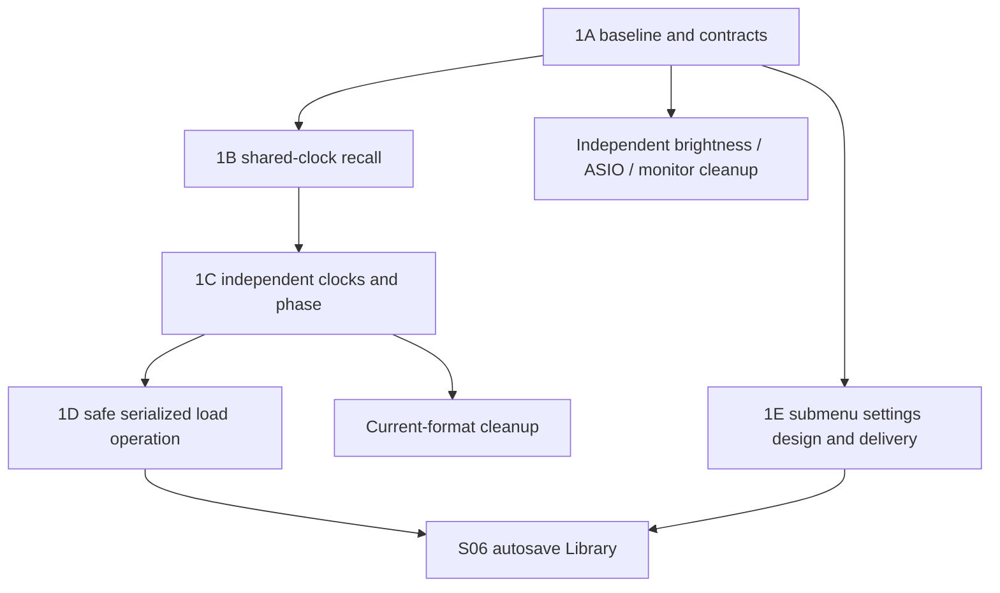

# First milestone: faithful sessions and one configuration surface

Date: 2026-09-05. Parent direction: [appliance roadmap](2026-09-05-feat-appliance-ux-roadmap-plan.md), S01–S03 plus the narrowly dependent S04 cleanup. Existing parent [919](https://github.com/tomassasovsky/segno/issues/919) remains plan-gated; this document prepares concrete work without implying implementation approval.

## Outcome

A player can save a musical idea, load a different one and return to the first with its defined audio/timing state intact. Every setup or repair entry opens the appropriate destination in the redesigned settings hierarchy. The application remains playable after each PR. This milestone deliberately precedes the autosave Library, whose design is already accepted but whose reliability depends on these contracts.

Keep Linux as the product target and macOS as the current developer launch target. Preserve existing audio, history, control and capture features. No engine rewrite, platform fork, new navigation framework or historical-format migration is needed.

## Evidence

- [Engine audit](../research/segno-looper-x-comparison/engine-audit.md): `lib/session/session_mapping.dart:135` drops saved musical settings; `SessionRig` lacks them; native session commit rejects Free/Song; crown cannot be unset through current apply; phase anchors reset.
- [UX audit](../research/segno-looper-x-comparison/ux-audit.md): SettingsPage remains reachable through recovery/update/keyboard entry points, while the eight-domain tray exists. Per-track one-shot and other unique old controls must be preserved before deletion.
- [Cleanup audit](../research/segno-looper-x-comparison/cleanup-audit.md): old Wi-Fi/Bluetooth pages are unused; brightness has two owners; historical monitor migrations still execute at boot. These are separate bounded changes, not an excuse to mix broad cleanup into session correctness.

## Part 1A — Baseline and contract (S01)

1. Recheck current master/worktree, existing 919/921, 263/682/854 and 494 work. Reuse their owners. Capture current appliance bundle, board firmware, known audio/update failures and reproduction evidence without copying private machine details into public docs.
2. Publish the audit/roadmap under existing documentation ownership. Once direction is accepted, supersede PR 921's old phase table. Correct stale progress/product assertions; keep build/test guidance and historical decisions distinct.
3. Record one current session contract in the session model/domain mapping and the issue. Inventory live intent as well as stored fields; classify each as session-owned, global device-owned, transient or explicitly deferred. Resolve discrepancies before changing write/apply code.
4. Use current `segno-ui.pen` rationale, not a retired frame. Inventory every reachable old Settings control and the target domain/tab. Preserve unique behavior before deleting anything.

Exit: reviewed field/entry inventories; one next action for each owning issue; no implementation behavior changed yet. This is a small documentation/contract delivery.

## Part 1B — Shared-clock musical recall (S02a)

Primary files:

- `lib/session/session_mapping.dart`, `lib/session/cubit/session_cubit.dart`.
- `packages/session_repository/lib/src/models/session.dart` and `session_repository.dart`.
- `packages/looper_repository/lib/src/models/session_rig.dart` and `looper_repository.dart`.
- Existing `AudioEngine` setters/snapshot contracts; extend native commands only if a missing reset/apply operation requires it.

Implement the smallest complete round-trip for Multi/Sync/Band through the existing save/load path. Extend `SessionRig` and mapping to carry saved musical state, and correct the bounded native restore contract needed to make it effective. Keep the existing load safety behavior during this fix; the stronger replacement-operation contract belongs to Part 1D below and is not a prerequisite for correcting dropped fields.

Setting existing controls in sequence is insufficient. `LE_CMD_SET_TEMPO` clamps zero to the minimum and changes the source to Manual; `LE_CMD_COMMIT_SESSION` clears the grid and every Sync divisor. A complete fix must preserve grid-off/derived/tapped/manual state, reconstruct the incoming musical grid and restore shorter-than-primary division tracks. Apply ordering must respect mode/tempo/content guards. Add only the necessary restore semantics at the current native boundary, with explicit acknowledgement; do not add an autosave scheduler or general transaction framework in this first PR.

| State | Expected treatment |
|---|---|
| Tempo, source, signature, quantize division | Preserve grid-off, derived, tapped and manual source states through restore, not through a setter that silently changes source. An unavailable external clock source remains visibly waiting/unavailable rather than silently acting locked. |
| Click mode, output intent, volume, count-in | Restore musical intent. Validate output against current hardware; preserve identifiable unresolved route rather than silently redirecting audio. |
| Mode, shared base, musical grid and per-track divisor | Restore whole multiples and shorter-than-primary Sync/Band tracks; grid/click phase and quantized actions work after import. Record the reset-to-no-crown gap for Part 1C if it needs a separate native operation. |
| Track names, lengths, lane routing and mix | Restore session values; missing hardware routes remain identifiable and safely unavailable. |
| Audio/history and effects | Retain current layered undo/redo and four-stage chain behavior. Do not flatten takes merely to simplify recall. |
| Pedal/control overrides | Preserve the existing global-versus-session contract; loading does not overwrite unrelated global mappings. |
| Device selection, network, brightness | Global appliance configuration; loading a musical idea does not replace it. |
| Active recording/pending gesture/capture worker | Transient work must be completed/cancelled through existing owners at the load boundary. Never serialize a live pointer or pretend a worker is a session field. |

The native restore change follows existing command ownership. Prepare required data off callback, publish immutable input and acknowledge actual committed state. Do not add callback locks or file I/O. Bound the first PR by musical-state restoration; full preflight/outgoing preservation is Part 1D's separate outcome.

Tests: extend `test/session/session_mapping_test.dart`, session cubit tests and repository/native behavior tests. Start with rig B configured differently from saved A; assert actual engine projection after loading A. Include grid-off, derived/tapped/manual tempo, audible click phase, quantized actions and sub-primary Sync/Band tracks. This catches dropped/reset fields that empty-rig or JSON-only tests miss. Existing malformed-input and FX/layer round-trip checks remain regression evidence; the broader failure/duplicate-operation matrix is Part 1D.

Exit: Multi/Sync/Band musical timing A→B→A passes; native acknowledgement matches visible success; no old UI replacement required to use the correction. Part 1C still owns the separately identified crown and phase gaps before full session fidelity is claimed.

## Part 1C — Independent clocks and phase (S02b/S02c)

Use separate PRs for independent-clock restoration and phase anchoring unless a demonstrated native invariant requires them together. Coordinate the phase PR with existing 854 instead of reimplementing its branch.

Files: native `packages/segno_engine/src/core/engine_session.c`, `engine_process.c`, `engine_snapshot.c`, `segno_engine_api.h`, applicable Dart models/bindings and the same mapping/rig application path. Inspect exact current ownership before choosing which functions change.

For Free/Song, add a native restore contract for per-track playable state, independent length/clock/phase and one-shot behavior. Do not fake a common master clock to bypass the existing commit rejection. Ensure restored history buffers become eligible for overdub/undo under the correct independent clock. The session file/domain model must carry the state required by this contract; a decoded buffer alone is insufficient.

For phase, preserve the defined as-played start anchor across save/load and stop/restart as specified by 854. State explicitly whether live cursor position is restored or playback restarts at a defined origin. The required musical placement is distinct from resuming an arbitrary sample mid-performance. Preserve primary-track ownership, including reset to none.

If persisted shape changes, write only the selected current schema and reject superseded shapes clearly. Do not create another migration chain. Historical bundle files remain untouched. Remove older format support only in a coherent, tested format delivery, not opportunistically before current round-trips pass.

Exit: unequal-length Free/Song tracks reload as playable, with correct independent timing and one-shot; new overdub/undo/redo after load works; off-bar/multi-cycle recordings do not rotate unexpectedly. Existing shared-clock mode tests remain green.

### Prepared-rig intent (S02e, a following correctness PR)

The existing saved fields do not describe the entire prepared instrument. Track names currently live in `TracksCubit`/global settings; `syncTempo`, loop-top quantize, per-track quantize overrides and empty-track routing/length configuration are absent or incomplete in the session model. Saving currently omits tracks without committed playable audio. Do not count these as restored merely because PCM loaded.

Proposed contract for direction review: names and prepared-track musical/routing settings belong to the session; device choice, physical routing availability and new-Scratch defaults remain global. Snapshot initial defaults into a new session once rather than keeping a live fallback to another session's values. Include empty tracks even when they have no PCM. Extend the existing TracksCubit/settings handoff and `session_persistence_sync_listener.dart`; do not create a second naming/routing cache. Define whether and how the loaded rig updates reconnect/cold-boot intent, so reconnect cannot silently restore the previous session's routes.

Make this a following correctness PR, not extra scope in S02a. Acceptance: save A/B with different labels, empty-track inputs/outputs, fixed length, sync-tempo and quantize overrides; alternate loading; begin a new recording and verify its actual source, boundary/length and name. Repeat after device reconnect and the defined cold-start restore path. If the owner retains any setting globally, amend this table and tests explicitly before claiming full fidelity. S06 waits for that disposition.

## Part 1D — Safe replacement operation (S02d)

After the narrow recall fixes, harden the existing load path before the autosave Library depends on it. Keep ownership in SessionCubit, the existing mapping/repositories and native apply acknowledgement. This comprises two independently useful PRs: safe repository publication, then the visible serialized load operation. Neither requires the future autosave scheduler.

**Safe publication first:** current repository save writes layer files in place before updating the manifest; a failed overwrite can damage the prior saved bundle. Change that writer to prepare new uniquely named assets, publish the validated new manifest last, and prune old assets only after successful publication. Preserve the prior valid manifest and its referenced files on every ordinary write failure. Keep this a session-repository operation, not a generic transaction package. Test full disk, interrupted/failed write, stale temporary files and publication failure. S06/S07 still own the measured power-cut/fsync guarantee and automatic checkpoint cadence.

**Then load ordering:** (1) serialize the request and fully preflight/freeze the incoming target, including when it equals the outgoing save destination; (2) request confirmation for any needed interruption, with Cancel leaving live audio untouched; (3) settle/finalize active loop recording/overdub, capture and transient held controls through their existing owners; (4) save the settled outgoing state through the safe writer; (5) replace the engine and acknowledge the result. Current saving skips active recording/overdub tracks, so checkpointing before finalization is not sufficient.

For an unnamed outgoing rig, use the existing Save As naming flow; cancelling or failing it cancels replacement and retains the current rig. Do not create a hidden unnamed checkpoint store. A named preserved session remains loadable through the existing session list; any recoverable stopped failure names that restore action. Read/freeze incoming data before saving over a same-named destination so target audio cannot change halfway through preparation.

Define Cancel before commit versus Hide while finalization/apply is running. A preflight failure leaves the current rig unchanged. If failure after native replacement begins cannot be rolled back within existing bounded memory, leave audio stopped and report the preserved recovery point; do not show success or silently resume a partial rig. Test invalid/future schema, truncated audio, capacity, missing dependencies, same-name load, full disk, native acknowledgement timeout, first recording, overdub drain, armed capture, momentary FX hold, double taps and Back. Finalization/save failure must not begin replacement. Current-format fixtures remain untouched by rejected loads.

Exit: the old session UI already benefits from safe serialized replacement; S06 can adopt the same operation without building a second loader. This is a separate PR from mapping, independent clocks and phase anchoring.

## Part 1E — Settings redesign with focused submenus (S03)

**Owner correction after the initial plan review:** a substantial UX/UI revamp closer to the Looper X is required, with submenus. The current eight-domain tray is not a design constraint. The owner agreed that musical recording behavior belongs in Loop and physical audio setup belongs in Audio. Exact menu names, layouts, entry presentation and default landing remain to be developed together before implementation.

This design work can proceed independently of native session fixes. Do not first polish/consolidate the existing tray merely to replace it again later. Preserve useful behavior and engine/repository seams while replacing the agreed user journeys.

**Additional owner requirement, 2026-09-06:** the encoder must navigate and operate the UI using visible focus. Apply the [shared encoder/focus contract](2026-09-05-feat-appliance-ux-roadmap-plan.md#rotary-encoder-and-visible-focus) to these settings screens from the first design, including a route in/out without touch. Turn-to-browse, press-to-activate, value-edit mode and explicit Back/Cancel are proposed interaction details to validate in the screen review.

### Next concrete design steps

1. Map the actual Looper X hierarchy: Loop Settings with focused timing/mode/length/decay/stretch/pedal subpages; Global Settings with General/Audio/USB Audio/MIDI/Info; separate Input/Track/Output routing and FX workflows. The reference page map is evidence, not a requirement to copy unsupported hardware controls.
2. Draft Segno's corresponding destination/submenu map, including its extra track/lane, capture, networking and appliance capabilities. The FX destination must account for an unlimited rack collection, input-specific racks and a separate eight-position/two-bank pedal assignment view; the detailed rack/state implementation belongs to S09. Identify every control's canonical home and its session/global scope. Recording behavior moves into Loop; audio hardware remains in Audio. Defaults and per-track overrides must be visibly distinct.
3. Design a representative settings journey end to end: enter via encoder or touch → choose submenu with visible focus → inspect current values → activate and edit → confirm/cancel → Back with restored focus → return to performance. Review layout, control density, typography, selection, value editing, pending/unavailable feedback and both-screen context. Reusing an engine or widget does not require retaining its previous layout.
4. Discuss the proposed screens with the owner, record accepted choices in `segno-ui.pen`, save and verify the source. Exact visual design is not approved merely by this direction update.
5. Refine this part into working implementation slices using those accepted screens; repeat the affected technical/UX review. Each delivered journey replaces and removes its previous interface. The final exit has one settings system, with no lingering old SettingsPage or parallel eight-domain implementation.

### Implementation seams and retained acceptance

Inspect `lib/app/segno_navigator.dart`, `lib/app/view/app.dart`, `lib/looper/view/tracks_view.dart`, `tracks_chrome.dart`, `settings_page.dart`, the current tray state and individual settings faces as implementation inputs. Reuse the existing semantic operations and one navigation owner; replace obsolete navigation state as needed. A new hierarchy does not require a new routing framework or another settings state owner.

| Entry | Required behavior; exact menu label awaits the design |
|---|---|
| Main settings entry / keyboard / context / development menu | Open the accepted settings home with consistent Back and close behavior. |
| Audio missing/stopped or device-selection repair | Open the relevant Audio hardware submenu with the affected device and cause visible. |
| Update notification | Open the canonical Updates submenu; suppress duplicate notification while already there. |
| Track context | Open the relevant track-specific configuration with track identity preserved. |
| Controller setup | Open the appropriate pedal/MIDI/CTRL submenu with current assignment context. |

Higher-level app callers must reach the single mounted settings owner through a typed navigation request. Define startup-before-mount and already-open behavior; no global singleton or second cubit creates competing state. Back must respect submenu depth and return to unchanged performance state. Preserve update-notification suppression and held-control lifecycle behavior.

Encoder integration crosses the current `ControlCubit.encoderTurned` master-gain path. Consume UI-context input before that performance action and cover the no-target/transition case, so a lost focus cannot change volume. Reuse the existing controller input seam plus Flutter presentation focus/actions; do not put FocusNodes in the controller repository or create competing focus state. Include lists, option grids, toggles, numeric editors, confirmation dialogs and the on-screen keyboard; show navigation focus distinctly from selected and editing state. Rebuilt content keeps stable focus identity and scrolls the target into view.

Verify rotation and encoder press/release on the active console-board implementation owned by S20. The inspected master event model lacks encoder push; hardware integration is not proven by a keyboard Enter test. Simulator events must use the same semantic path, and a separate device check proves detents, press and context ownership across the two displays. Settings focus must not disable unrelated performance pedal gestures unless an existing busy/confirmation contract requires it.

Inventory unique old controls before deletion, including per-track one-shot, quantize defaults/overrides, pedal behavior, device parameters, timing, appearance and updates. Keep truthful current availability until new engine semantics land. Shared helpers used by surviving screens must move to an appropriate shared definition before deletion. Generic MIDI remains distinct from the console firmware transport.

Exit: the accepted submenu-based visual and interaction design is implemented; recording/hardware separation, encoder-only entry/navigation/edit/exit, touch handoff and all failure/Back paths pass; prior UI is removed. Navigation portions of the previous review must be refreshed against the concrete new design. Independent session correctness findings and contracts remain applicable.

## Part 1F — Bounded ownership cleanup (S04)

These changes can follow independently; do not make them prerequisites for fixing session recall unless their exact code overlaps.

1. **Brightness:** the existing display owner controls hardware/persistence. Make tray state own navigation only; remove cubit-to-cubit forwarding, raw client and missing-provider fallback. Test cold restore, rapid adjustment and hardware failure with one injected seam.
2. **Monitor formats:** remove `runMonitorMigration` and sole-use retired settings accessors after current monitor boot/round-trip checks pass. Preserve current On/Auto/Off behavior and data validation. No migration framework replaces it.
3. **Session/FX legacy formats:** remove superseded decoders as part of the current-format contract after 1B/1C pass. Unsupported bundles stay on disk, with clear visible failure. Do not confuse unknown/corrupt current data with an old version.
4. **ASIO:** complete 925, including hidden current Device-tab branches, constructor/state/persistence strings and unused native ABI fields if applicable. Regenerate bindings and check built symbols for ABI changes. Retain Linux and current macOS dev startup; do not edit unrelated platform implementation inside vendored libraries.

Exit: exact deletion list reviewed, one owner per live value, no lingering compatibility routes for the retired formats. This is not a target line-count exercise.

## Dependency and PR sequence



Recommended first build: 1B's reproducible musical-state loss fix, with 1E as the independent UX work if capacity exists. Keep phase/clock extension and optional cleanup out of that first correctness PR. No branch should accumulate the entire milestone before it can be exercised. S05a visual infrastructure can start independently against an existing screen; changed rendered settings controls use that gate without waiting for S05b performance redesign.

## Validation and acceptance matrix

| Scenario | Observable pass |
|---|---|
| Save A, configure/load different B, reload A | Native/projected musical state matches A; route and effect state do not leak from B. |
| All five modes | Basic record/play/overdub still works before/after save/load; mode-specific lengths/clocks preserved. |
| Free/Song unequal tracks | Playable independently after reload; correct one-shot; undo/redo and a new overdub succeed. |
| Crown → no crown; off-bar multi-cycle take | No stale primary ownership; defined musical start anchor retained. |
| Invalid/truncated/too-large/incompatible session | No false success; preflight preserves current rig where possible; post-commit failure gives safe stopped recovery and original files remain. |
| Double load / Back / pedal while loading | One operation owns replacement; cancellation has defined boundary; no duplicate apply or held gesture stuck on. |
| Current-format and historical-format load | Current round-trip works; unsupported historical version explains failure without conversion or disk mutation. |
| Encoder focus / touch handoff | One visible target; turn browses until explicit edit; press activates once; modal focus is contained/restored; off-screen content follows focus; UI input never also changes master gain. |
| Missing audio / update / keyboard/menu setup | Correct accepted settings submenu and unchanged return state; no superseded Settings route. |
| Linux product / macOS developer launch | Existing appliance build/checks pass; Mac launches same UI for small tests without reviving desktop product logic. |

Run focused root session and changed widget/cubit tests plus affected repository package suites. The current real-engine session suites self-skip when `SEGNO_ENGINE_LIB` is unset. Build the existing test library and use `PumpedNativeEngine`; add new recall cases to the existing fuzz-tagged Linux gate, and retain observed non-skipped results. Use the working Flutter command from PROGRESS:

```sh
segno_test_lib="$(bash packages/segno_engine/tool/build_test_lib.sh)" && test -s "$segno_test_lib" && SEGNO_ENGINE_LIB="$segno_test_lib" flutter test test/session
```

The build helper's stdout is the library path; the chained assignment/file check fails closed if compilation fails or returns no library. No device is needed for this deterministic pump. Confirm the command did not merely pass mock tests while skipping the native suites. The Linux `fuzz` job already provides this setup; extend it rather than adding a second harness. Run native tests for native/domain changes and current CI analyzers/coverage for all touched packages. After C API changes, use `dart run ffigen --config ffigen.yaml` from `packages/segno_engine`, format generated bindings and run symbol parity against the Linux artifact. Header changes also require the documented C++ shim check. Run ASan and telemetry-disabled native configurations where native behavior changes. No full DSP or firmware change is planned in this milestone unless a proven dependency demands it.

Actual appliance proof remains required for real audio timing, two-screen/touch behavior, reconnect and durable storage. A macOS run or mocked engine is useful local evidence, not completion of that gate.

## Success Criteria

```success-criteria
GOAL: Make current Segno sessions faithfully recall their defined musical state and deliver the accepted submenu-based appliance settings redesign without losing working features.

SUCCESS CRITERIA:
- Shared and independent mode recall passes the A/B, no-crown, phase, history and failure matrix. | verify: manual Execute the matrix above at the built revision using native-backed fixtures and the appliance; retain observed state/audio results.
- Existing session mapping, cubit and native-backed round-trip tests execute without skips and pass with new semantic assertions. | verify: segno_test_lib="$(bash packages/segno_engine/tool/build_test_lib.sh)" && test -s "$segno_test_lib" && SEGNO_ENGINE_LIB="$segno_test_lib" flutter test test/session
- The native regression suite passes after session contract changes. | verify: bash packages/segno_engine/src/test/run_native_tests.sh
- Settings and their dialogs can be operated with encoder focus, alongside touch, without changing unrelated performance values. | verify: manual Run the shared encoder/focus scenarios from Stage on the actual console, including press, Back, cancel, dialog and focus-loss cases.
- Every old settings entry opens the correct canonical redesigned settings home and returns without changing performance state. | verify: manual Exercise every entry in Part 1E in empty, playing and error states on both screens; verify removal in the reviewed diff.
- Unsupported retired formats leave source bundles untouched and clearly explain why they cannot load. | verify: manual Run historical-version fixtures and compare source bytes before/after; current-format fixtures must still reload.
- Linux appliance verification is recorded separately from successful macOS developer launch. | verify: manual Inspect the owning issue's exact-revision CI, developer launch and appliance scenario evidence.

NON-GOALS:
- Redesigning the full Stage, building the autosave Library yet, adding FX modules or implementing MIDI sync.
- A second engine, second navigation framework, backward-compatibility layers or deleting historical user audio.
- Desktop product support or removal of the current macOS development target.

VERIFICATION COMMAND: segno_test_lib="$(bash packages/segno_engine/tool/build_test_lib.sh)" && test -s "$segno_test_lib" && SEGNO_ENGINE_LIB="$segno_test_lib" flutter test test/session && bash packages/segno_engine/src/test/run_native_tests.sh
```

Use the working SDK from PROGRESS when `flutter` is not the configured shell command. These listed commands are the minimum relevant regression floor; applicable analyzers, format, package coverage, ABI and device gates above remain required.

## Risks and open boundaries

The hard part is consistent application under the current engine guards, not adding fields to JSON. Prototype ordering/capacity and independent-clock state first. The exact resume-cursor versus musical-origin contract must be recorded with 854 before its implementation. Current-format resets must preserve files and expose unsupported state. New persistence guarantees require measured durability in S06/S07; this milestone does not claim power-cut safety merely because normal save/load works.

When this milestone lands, update source contracts and current progress baseline, remove obsolete pen frames only when their replacement is the accepted implemented screen, and attach one working demo per delivery. The next milestone is the accepted Library, not another architecture reset.
