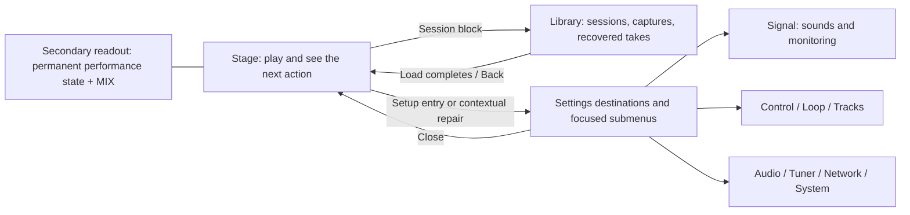

# Segno appliance UX and feature implementation roadmap

Date: 2026-09-05. Parent: [919](https://github.com/tomassasovsky/segno/issues/919), existing `autonomy:plan-gate`. Status: **proposed direction, prepared for review**. Baseline: `aaf042655b5059d9aff7c647a02249c1d019de84` plus the inspected working tree. No redesign implementation or hardware validation is claimed by this document.

> **Owner direction update after review:** settings must receive a substantial UX/UI redesign closer to the Sheeran Looper X, with focused submenus. The owner agreed to put musical recording behavior in Loop and audio hardware setup in Audio. The earlier recommendation to keep the eight-domain tray is superseded. Exact menu hierarchy and visual design remain to be developed with the owner; previous navigation-review conclusions do not approve that future design.

## Overview

**Owner clarification, 2026-09-06:** the reviewed designs are the specification for the product we want, including features, behavior and UX. This plan follows that target. Existing code informs reuse, dependencies and effort; it must not constrain the target to features already implemented. Retained foundations below may be changed when needed to fulfill the design. Record implementation gaps separately from product rules, and give every intended restriction a product rationale rather than inheriting it from the current engine.

Rebuild Segno's user experience around complete musical tasks while retaining the engine, domain boundaries and working controls. First make session recall reliable and configuration singular; then finish the accepted autosave Library; then deliver named sounds and the remaining Looper X capabilities in independently usable slices. Every slice includes its failure paths, persistence, control integration and removal of superseded code.

The supported product is the **Linux appliance**. The current macOS target remains for small developer tests and UI inspection. No desktop feature programme, platform-general navigation or Windows/iOS/Android support is introduced.

The [complete reference](../research/sheeran-looper-x-1.0.2/README.md) documents Looper X 1.0.2. The [comparison](../research/segno-looper-x-comparison/README.md), [40-row journey ledger](../research/segno-looper-x-comparison/journey-ledger.csv) and [cleanup audit](../research/segno-looper-x-comparison/cleanup-audit.md) are the evidence behind this roadmap. They remain dated snapshots; GitHub issues own live status.

## Problem and retained foundations

Repeated work has concrete causes: design and shipping UI diverge, obsolete settings/migrations still execute, issue premises lag behind code, and partially implemented APIs are mistaken for complete product features. A style-only pass would preserve those problems. A new application would discard tested foundations and create another incomplete replacement.

Keep:

- Native transport, command ownership and real-time boundaries; the typed `AudioEngine` seam and deterministic native tests.
- Eight tracks/two banks, multi-input lanes, bounded layered undo/redo and undoable clear.
- Input/Loop/Track/Master FX stages, dry recorded material, frozen inherited chains, stable slot IDs and worker-rendered wet caches.
- The unified control dispatcher, MIDI learn/ranges, pedal simulation and separate audio/MIDI lifecycles.
- Performance capture, recovery infrastructure, render/export models and DAW conversion explanations.
- Existing console widgets, FX parameter editor and two-screen readout. Their names or file sizes alone do not justify replacement.

The independent session-correctness work remains necessary: session mapping drops saved musical settings, independent Free/Song clocks do not restore completely, and crown/phase can inherit or reset incorrectly. The [first milestone](2026-09-05-feat-appliance-ux-roadmap-part-1-plan.md) specifies how to close those seams without a new persistence architecture.

## Product and UX contract

### User tasks and submenu-based settings



The diagram groups user tasks; it does not prescribe three fixed top-level buttons or preserve the eight-domain tray. Redesign the settings hierarchy using Looper X-style main destinations and focused submenus. The exact Segno page map and visual treatment remain under discussion. The owner clarified on 2026-09-06 that the roles of the 7-inch and 15.6-inch screens remain undefined. The existing performance readout, MIX and staged timeout behavior are precedents to evaluate, not automatic constraints on the new division of work.

| Place | Primary job and path | State and failure contract |
|---|---|---|
| Stage | Record/overdub/play/mute/undo with pedal-first gestures; session block opens Library; one Setup entry | Main/readout/pedal agree on bank, interaction mode, record/arm/count-in/pending actions and capture state. No color-only distinction. A view change never changes audio. |
| Library | Sessions/Scratch on left, detail on right; related captures, all captures, quiet Recovered; import/export at the relevant object | Preserve accepted pen gesture: row tap requests load and returns to Stage on success; chevron opens detail without loading. Detail actions operate on the selected object, not implicitly the currently sounding session. |
| Signal | Input/Loop/Track/Master → named placement → rack/effect → parameter editor | Explain live processing versus frozen recorded copy. Touching an overview tile opens its editor; it does not jump the value. Direct mix sliders remain deliberately live. |
| Control | Pedal/MIDI/CTRL → assignment → named placement → optional effect/parameter | Preserve learn, collision Replace/Cancel, LO/HI/inversion and stable identities. Missing targets stay identifiable and repairable. Generic MIDI is separate from the appliance's own console transport. |
| Loop / Tracks | Musical timing and mode defaults / individual names, lengths, routing and playback behavior | One source for requested/applied/pending values. Show mode/record/clock restrictions with cause. Do not show inert all-mode one-shot as functional. |
| Audio / Tuner | Hardware selection/recovery / tune chosen source | Every no-audio repair opens the exact Audio tab; tuner reference and output policy are explicit. Physical gain/phantom controls appear only for supported hardware. |
| Network / System | Connectivity, storage, updates, display and safe shutdown | Offline performance continues; update notification opens the same Updates home; no restart during protected persistence/capture/transfer. |

**Screen grouping above:** Signal, Control, Loop, Tracks and the other names describe capability homes for coverage. Their current rail/tab arrangement is superseded as a fixed UI requirement.

**Accepted design retained:** pen `c/library` nodes `TjF1s` and `Ap1Qr` specify autosave/Scratch, Library entry and global named racks with embedded/frozen copies. The old desktop-export clause is superseded by appliance scope: exports belong in appliance Library detail. Record that departure in the pen when the corresponding design slice lands. Do not resurrect Finder-dependent workflows.

### FX rack collection, input effects and eight pedal positions

**Owner requirement, 2026-09-06:** FX mode presents eight fully assignable positions across two banks of four. The collection of FX racks must support unlimited additions rather than an eight-rack product limit; eight describes the pedal-access positions, not how many racks can exist. Input-specific FX are required alongside the existing Loop/Track/Master placements. Rack activation must support pedal-state mappings such as `1` and `!1`.

Keep these concepts distinct:

| Concept | Identity and capacity | Product meaning |
|---|---|---|
| Saved rack definition | Stable library identity; no artificial rack-count cap | A reusable named sound, with existing global-library and embedded-copy rules. |
| Rack instance in the current rig | Its own stable identity, placement and parameters; not limited to eight instances | A loaded sound on a particular input, recorded lane, track or master. More than eight racks may be configured in the rig, including racks without pedal assignments. |
| FX pedal position/state | Eight logical positions presented as Bank A/B, four visible at a time | A freely assignable control identity. Its number is not a track number or rack-array index. One state can drive multiple rack instances. |
| Effect module inside a rack | Part of the rack's ordered processing chain | Distinct from both rack count and pedal count. Native module/parameter capacity must be measured and expanded separately. |

**State semantics — owner confirmed both:** support latched on/off conditions and physical held/released conditions, with normal/inverse forms for either. `1`/`!1` identify normal/inverse polarity but the assignment UI must also identify which state source it means; an ambiguous bare number must not conceal that distinction. Apply both sources to every logical FX position. Multiple rack assignments may refer to one pedal, including different state sources; do not force every target of that pedal to share one global toggle-versus-momentary mode.

| Assignment source | Normal | Inverted |
|---|---|---|
| Latched pedal state | Rack active while that FX state is on | Rack active while that FX state is off |
| Physical pedal state | Rack active while that pedal is held | Rack active while it is released |

A released condition describes a state, not a one-time release event. Press/release gesture timing must make latched and momentary use predictable, including when one pedal drives both; define it explicitly before implementation. Composite AND/OR rules have not been requested and must not silently grow into a generic expression language.

Under that interpretation, a pedal can switch combinations: for example, Guitar Drive follows `1`, Guitar Clean follows `!1`, and Vocal Echo can also follow `1` on a different input. These are independent rack instances controlled by the same logical state. There must be no one-target-per-pedal restriction masquerading as full assignability. Multiple simultaneous pedal states are permitted; this is not inherently a one-active-rack radio group. Unassigned/always-on racks remain usable without consuming a pedal position.

**Input-specific processing:** choose an input and see its own ordered rack instances, sound parameters, enable state and assignment conditions. Input FX must be assignable through either bank and may stay unassigned/always on. Sharing a saved definition does not merge the live state of two input placements. Preserve the existing dry-capture/frozen-inheritance decision: changing an input rack later must not silently rewrite recorded takes. Specify which effective values and enable state are captured at the record boundary, and log/replay audible changes through the existing capture contract.

**Proposed FX UX:** an eight-position Pedal Banks view shows what each state controls, alongside an All Racks view for the complete current rig, input/placement filters and the saved-sound browser. Input detail provides its contextual rack list. Assignment shows the named target, normal/inverse condition and effective audible state; every path supports the shared encoder focus model. Bank switching changes which four controls are presented, not sound state by itself. Stable identities preserve assignments when lists are sorted/reordered or racks renamed. Missing targets remain identifiable and repairable; removing a rack never redirects its assignment to the next list item.

No fixed eight-rack limit may remain in UI, storage, assignment or live-rig models. Actual processing capacity is constrained by measured CPU/memory; that must not be confused with the eight pedal positions or presented as unlimited physical DSP. Plan additions/render graphs outside the audio callback, retain bounded callback work and reject an over-budget activation truthfully without dropping an existing sounding rack. Dynamic collection support must not become unbounded allocation or parsing on the real-time thread.

**Current implementation gap:** `PedalBinding` has one target and toggle/momentary behavior; `PedalBindingSet` keeps one binding per control key. It does not implement the requested normal/inverse rack-state routing or multiple targets from one logical pedal state. The binding resolver already enumerates Input/Loop/Track/Master targets; retain that scope coverage and stable identity work. The new model must own pedal states separately from target enable state, define manual bypass versus condition precedence, and produce one coherent update for complementary rack switches. Keep the typed engine seam; do not keep the old single-target assignment path as a parallel implementation once replaced.

Before building, settle the remaining behavior in the FX design review: exact labels/notation and press/release timing for the confirmed latched and physical state sources, manual-bypass precedence, state initialization/session recall, behavior on leaving FX mode and controller disconnect, and shared-state changes during held gestures. Preserve latched state on mere bank browsing; release must address the bank/position that was pressed even if the visible bank changes. Define disconnect and FX-mode-exit handling explicitly for inverted released-state conditions, so a lost controller cannot unexpectedly engage racks. Momentary input must never strand an active rack. Session/library persistence must retain the complete rack collection and assignments, while a changed global library definition does not alter frozen copies.

Acceptance must include more than eight saved and live rack instances; racks on multiple inputs; assigning any eligible instance to either bank; several targets sharing one normal/inverse state; both latched on/off and held/released conditions, including mixed use of one physical pedal; independently active states in both banks; bank switching without audio changes; rename/reorder/delete/missing-target cases; session recall; touch/encoder parity; resource rejection; and capture/replay of the resulting audible state. The physical eight-position mapping is verified with the current console-board owner, not a revival of the old pedal transport.

**Concrete design study, 2026-09-06:** [FX screens, state rules and verification](../design/2026-09-06-fx-ux-design.md) now propose press/release timing, bypass precedence, drafts, bank-release capture and disconnect/reconnect behavior. The owner requested less text and no routine bottom bar; the physical allocation of task and performance content remains undecided between the 15.6-inch and 7-inch screens. The factory content and artwork are imported with source hashes. [The original-reference atlas](../research/sheeran-looper-x-1.0.2/rendered/atlas.html) distinguishes adapted QML from reconstructions. These artifacts refine the plan; they do not establish production DSP parity or replace the remaining FX-mode-exit, recording-boundary and device checks.

### Rotary encoder and visible focus

**Owner requirement, 2026-09-06:** the rotary encoder must control the UI through a visible focus, alongside touch. This is part of the submenu redesign and applies to its shared interaction model across settings, Library, effects, dialogs and other interactive surfaces. It is not complete when the encoder only changes master gain or a touch-selected parameter.

Proposed interaction grammar for the screen-design review:

| Context | Turn | Press / exit |
|---|---|---|
| Browsing menus, submenus, lists or controls | Move one focus step per detent in a predictable reading order; keep the focused item visible | Press opens/activates the focused item. A focusable Back action returns one level and restores parent focus. |
| Editing a value | Adjust the focused value using its meaningful step/range; show a distinct editing state | Press finishes editing and returns to navigation. Explicit Cancel restores the opening value where live preview is supported. |
| Toggle or discrete action | Moving focus alone has no effect | Press performs the same semantic action as touch; destructive operations still require their confirmation. |
| Dialog or on-screen keyboard | Traverse only that active surface, including Cancel/Back and keys | Activate the focused control; closing restores focus to its opener or a defined nearby surviving item. |

Focus is an unmistakable outline/highlight plus clear item/value identity, not just a color change. Touch and encoder share the same focus and actions; touching an editable control establishes the encoder target without an unrelated value jump. Distinguish focus, selected option and active editing visually. Long lists scroll to focused content. Notifications, transport polling, changing values or a passive second display must not steal focus. When a target disappears or becomes unavailable, preserve a deterministic safe focus and explain the unavailable state; never execute the next item automatically.

The encoder belongs to exactly one active input context. While a menu/editor/modal is open, its events must not also change master gain or reach underlying performance controls, including during focus transitions or when no valid target exists. Performance-volume behavior outside UI navigation must remain explicit and visible; its precise entry/exit gesture is part of the upcoming design. Provide a complete encoder-accessible route into the UI and back to Stage. Long-press shortcuts or accelerated value changes are optional later choices, not requirements silently added to the hardware contract.

Implementation should adapt encoder input to semantic navigation/activation/adjustment actions and reuse Flutter's focus scopes and traversal support. Keep focus nodes/lifecycle in presentation, preserve the current controller/engine boundaries and avoid a second focus tree in a Cubit or repository. Flutter documents scoped focus, traversal and focus restoration; routing rotary input into those semantics is the proposed Segno adaptation. [Flutter focus documentation](https://docs.flutter.dev/ui/interactivity/focus)

Current-source boundary: `ControlCubit.encoderTurned` directly changes master gain, and the inspected pedal event model carries encoder rotation but no encoder-push button. Individual widgets having keyboard focus does not provide whole-UI rotary navigation. Verify the active console-board branch's turn/press/release support with its existing owner; extend that current transport if required, never revive the obsolete AVR/SysEx implementation. The simulator must exercise the same input semantics, while actual detents, push and two-screen focus ownership need appliance validation.

### Persistence, load and operation rules

1. **An acknowledged save is meaningful.** Named sessions and Scratch include audio/history, musical timing, independent clocks, routing, effects, names and relevant assignments. The part-1 contract identifies fields and intentionally global settings. Persistence tests must load into a different existing rig; JSON round-trip alone is insufficient.
2. **Autosave is a persistence feature.** Checkpoint after a completed recording/overdub and after durable edits, with a short measured debounce for rapid parameter changes. Show Saving/Saved/Error from the actual write result. Ongoing recording and unacknowledged work have an explicit recovery/loss boundary; do not label them saved. Prepare/fsync required data and publish a valid manifest off the real-time callback. Measure the achievable checkpoint delay on target storage before setting a maximum loss guarantee.
3. **Loading is one serialized operation.** Preflight version, capacity, samples and dependencies before replacing audio; settle active recording/overdub/capture and held-control intent, then preserve the outgoing checkpoint through the safe writer. During playback/record/capture, show the proposed stop/finalize-and-load boundary with Cancel. Stop only after explicit confirmation; no seamless setlist promise in the initial slice. A second tap cannot enqueue a second apply. Hide/Back is not automatically Cancel.
4. **New means a new identity.** New session creates/activates persisted Scratch after preserving the outgoing session. Clear audio remains undoable within the current session; it does not masquerade as New or leave an accidental overwrite destination.
5. **No backward compatibility.** Select the current schema for each landed format. Unsupported historical versions receive a clear outcome without conversion or modifying their directories. Defensive validation and current-format defaults remain. Never delete user audio as a side effect of removing parsers.
6. **Long operations identify their source and result.** Import, bounce, render/export and capture completion expose preparation/progress/cancel or hide semantics, partial success, capacity and destination failures. Shared mechanics may be factored when a second operation actually needs them; do not create a generic job framework first.

### Better UX: proposed observable targets

Targets are hypotheses to test, not measurements achieved by this documentation.

| Task | Target and measurement |
|---|---|
| Resolve no audio | One tap from every failure banner opens the affected Audio control; scripted missing/stopped/reconnected-device cases recover without opening a second settings shell. |
| Inspect another session | Stage → Library → chevron detail in two actions, without changing audible/session state. Deliberate load applies once and returns to Stage. |
| Preserve a new idea | Record into Scratch, finish a take, wait for Saved; restart and recover that acknowledged take with its timing, sound and history. Repeat with failed/interrupted writes. |
| Recover a capture | Recovered appears only when nonempty; expand → Keep promotes the selected take, survives restart and removes recovery-only expiry. Test the accepted 30-day retention with a controlled clock. |
| Recall a sound | From a selected Signal placement, open catalogue → select → commit within three deliberate choices. Cancel audition restores sound and mappings. |
| Diagnose silence | One contextual path identifies source, monitor, lane/track mute/level and output gate. Run five silence scenarios with a player unfamiliar with engine terminology; record wrong turns/time. |
| Export from the appliance | Detail → Export makes artifact/destination/effect treatment clear. Independently reopen USB results; exercise no/full/removed drive and partial render. |
| Perform while configuring | Both screens and pedals remain consistent during every tested mode/bank/settings transition. A held gesture must not be stranded by navigation/disconnect. |
| Navigate without touch | From Stage, enter settings using the encoder, traverse a submenu, edit/cancel a value, handle a dialog and return; focus stays visible and master gain is unchanged during UI navigation. Repeat after touch handoff and target removal. |
| Understand an unavailable action | Label the actual cause and safe resolution where one exists; busy controls prevent duplicate commits. Check recording, external-clock, missing-device and insufficient-storage states. |

The Looper X reference supplies observed interaction patterns. Ableton Push provides another appliance-oriented precedent for focused mix/device/browse tasks and consistent clip state across views; this supports task separation, not copying its layout. [Official Push manual](https://www.ableton.com/en/push/manual/)

Visible operation feedback, progressive disclosure and reversible exploration motivate the targets above. They are design rationale rather than evidence that this proposal has already passed usability tests. [Nielsen Norman Group: system status](https://www.nngroup.com/articles/visibility-system-status/), [progressive disclosure](https://www.nngroup.com/articles/progressive-disclosure/), [user control](https://www.nngroup.com/articles/user-control-and-freedom/)

## Delivery slices and dependencies

`Sxx` identifies a bounded outcome in this plan, not a new issue. Reuse the owner shown. “New child” means prepare a narrow child of 919 or the named existing epic when that slice is ready; do not open 22 parallel work streams now. Larger gated slices require a short implementation refinement against the then-current code before build. Estimates below are relative scope, not calendar promises.

### M0 — A reliable baseline and one product vocabulary

| Slice / size | Concrete change and primary files | Depends on / existing owner | Exit condition |
|---|---|---|---|
| S01 Baseline and scope / small | Reconcile 919/921, this register, active pen rationale and stale progress assertions; record exact appliance build and known reliability failures | Direction decision; 919, 911 | One active programme, every referenced issue's remaining outcome identified, no false claim that a present API or branch is shipped. |
| S02 Faithful session recall / several narrow PRs | Extend mapping/`SessionRig` and bounded native restore semantics for source/grid/divisions; then independent clocks, crown/phase, prepared empty-track intent and a separate safe-load operation | Existing 263/682; coordinate 854 | A→B→A recall across all modes preserves defined musical state and playable audio; preflight/failure leaves recoverable data; specific part-1 acceptance passes. |
| S03 Settings UX/UI revamp with submenus / design then complete journey slices | Map Looper X-style destinations/submenus and Segno additions; update pen; implement layouts/editing/navigation through current app seams; redirect recovery/update paths and remove replaced UI | Design discussion independent of S02; 919/494; refine implementation after page-map agreement | Actual submenu-based redesign with visible encoder focus and complete turn/activate/edit/Back paths; recording behavior has one Loop home, hardware setup one Audio home; clear Back/return-to-performance; all entry paths and unique controls covered; predecessor UI removed. |
| S04 Remove obsolete ownership / small slices | Brightness ownership, `monitor_migration.dart`, old settings/session/FX parsers, ASIO surface and bindings where unused | Current-format contract in S02 for session parsers; 925 plus narrow 494 children | One brightness state owner; current formats round-trip; historical files remain untouched with clear unsupported result; no application ASIO or boot migration path; Linux/macOS dev boot retained. |
| S05 Performance baseline and visual proof / two independent outcomes | S05a: reproducible visual harness against an existing surface; S05b: Stage/status/readout/pen performance reconciliation | S05a needs S01 only; S05b uses S03 navigation fixtures; 973/878/504/506 | Main/readout/pedal agree on modes, banks, pending actions and history; deterministic visual checks execute in CI; distance/touch test recorded on target display. |

S05a establishes Linux-compatible fonts/toolchain and a demonstrably non-skipped check against an existing representative screen before changed rendered UI needs that gate. It does not wait for new navigation. S03 then adds relevant scenarios; S05b handles performance design and target-distance evaluation. Dead-page removal needs surviving behavior/reachability checks, not a new image merely because the deleted file was a widget.

S05 also records the disposition of conditional screen lock (UX40): keep accidental-touch protection and safe configuration first; add a lock only if a performance test demonstrates a remaining problem. That is a proposed deliberate exclusion from the first release, not a claim that Looper X lacks it.

### M1 — Ideas survive, and recordings are easy to find

| Slice / size | Concrete change and primary files | Depends on / existing owner | Exit condition |
|---|---|---|---|
| S06 Autosave Scratch and session Library / large, refine into backend then complete UI slices | `lib/session/`, `session_repository`, `stage_status_bar.dart`, power-off gate and new Library views in the existing feature; replace manual manager | S02, S03; 682 | Existing accepted Library works: New/Rename/Save a copy/detail/load/delete; Saved reflects durable checkpoint; busy/failure/cancel/load/shutdown rules tested; old Save/Save As dialog and callers deleted. |
| S07 Captures and Recovered in Library / medium | `lib/performance/`, performance repository salvage/catalogue; accepted Library capture frames | S06 Library shell; 682 and 727 | Session-associated/all/recovered lists; Keep/Delete/retention verified; immutable arm-time provenance; capture durability independently proven, with truthful loss boundary. |
| S08 Appliance export / medium | Session/performance detail, repository export, `daw_export`, storage destination and render result UI | S06 and S21a storage feasibility; reuse S07 capture catalogue when available; 926/279 | Session bundle, explicitly dry stems, audible render and performance/DAW export have distinct contracts. No unbounded LCM render for Free/Song. Destination/progress/failure/reopen checks pass without a desktop file manager. |

S06's storage change must remain usable before its visual replacement lands: first add reliable checkpoints behind the existing session operations with visible truthful status, then switch to Library and remove the old manager in one complete UI delivery. Do not expose two save policies simultaneously. The precise checkpoint cadence and interruption guarantee are a measured subdecision before calling autosave complete.

S08 must not label the current raw lane-sum mixdown an audible mix. Reuse the performance renderer only where its representation matches the job; add an explicit finite render range, sample-rate and FX/click/backing policy. Missing effect implementation yields an explained partial/unsupported result, not silent sonic change. DAW bar alignment remains 279's musical export acceptance.

### M2 — Sounds have names, independent placement and assignable controls

| Slice / size | Concrete change and primary files | Depends on / existing owner | Exit condition |
|---|---|---|---|
| S09 Rack collection, input FX and assignable pedal banks / refine into collection, state mapping and complete UX slices | Named definitions and stable live rack instances; uncapped rack collections, input placements, eight assignable FX positions and normal/inverse state rules; Signal/Control/session/engine seams | S02, S03; 535/494 with S20 input integration; coordinate capacity with S10 | More than eight racks persist and remain addressable; both banks freely assign to eligible targets; input-specific and shared/inverse state scenarios pass; copy/audition/modified rules remain coherent. |
| S10 Parameter capacity and editor reconciliation / medium | `track_effect.dart`, native FX descriptors/storage, C API/generated bindings, editor and export parameter mapping | Existing 887 programme; can begin after S01 with stable schema agreement | Bounded parameter shape supports real planned modules, physical/named units have verified mappings, presets round-trip, stable IDs survive edits; pen/code discrepancies resolved without rebuilding the tile editor. |
| S11 Factory racks and sound validation / multiple independently audible modules | `src/fx/`, effect descriptors, factory catalogue/preset mapping and relevant DAW export mapping | S09 catalogue/placement contract and S10; 887/888/891 | Each admitted module/preset sounds and persists correctly, exposes supported controls and has CPU/quality evidence. Catalogue distinguishes reference content from validated Segno sound. All 9 families/159 presets accounted for. |
| S12 Complete mix/track tools and expose existing repair / several narrow slices | Tracks/Loop/Tuner/Signal faces; engine snapshots/commands; conditioning cubit; waveform view | S02, S03, S05; 263 residual, 697, 909 and named children | Per-track one-shot has truthful mode semantics; decay, pan/solo, tuner reference/output and main Wave tasks delivered with persistence/controls; conditioning/repair can be compared/reverted. Each capability has its own scenario gate. |

S09 is no longer only a named-chain browser: refine its rack-instance/capacity and pedal-state contracts before implementation and refresh the affected review. Eight pedal positions must not become the rack storage/processing model. The library, instance model and assignment UI should ship as working slices without preserving the old single-target implementation in parallel.

Rack semantics proposed for S09: topology/order/bypass/values contribute to MODIFIED; momentary pedal holds are transient. Saving a definition is explicit, not a side effect of turning a performance control. Loading creates a placement with independent stable slot identity. Deleting a definition leaves recorded/loaded copies sounding. Factory/user entries share browsing concepts, not necessarily one DSP graph implementation.

S11 is the existing factory-rack programme, not a promise that copying 159 normalized JSON files recreates the original algorithms. The extraction establishes names, topology/control schemas and values; taper curves and audible response remain unresolved. Keep a module/preset ledger with **content mapped / controls functional / audio validated / appliance budget passed**. The owner's existing content authorization is preserved. Do not claim exact sonic equivalence without reference recordings and a defined comparison method.

S12 is a milestone bundle, not one PR. Deliver pan/solo, one-shot/decay, tuner, Wave and repair visibility separately; preserve one native state path per behavior. Per-track stereo balance requires an explicit channel/pan law compatible with mono lanes and output masks. The new Wave view uses existing waveform projection where suitable and adds per-track data only as required; it is not a DAW editor. Non-destructive mode conversion, if selected, receives a compatibility table and separate tests.

### M3 — External timing and media operations

| Slice / size | Concrete change and primary files | Depends on / existing owner | Exit condition |
|---|---|---|---|
| S13 MIDI clock output / medium | Native clock ring consumer, MIDI output lifecycle, `AudioEngine`/repository contract, Control/Loop status | S01 baseline; 263 C2; physical DIN evidence 1007 | Actual device receives Start/Continue/Stop/Clock as specified; one clock owner, reconnect/off/overflow semantics; jitter measured under target load. Ring-only tests are insufficient. |
| S14 Empty-track audio import / medium | Library/file selection/preview, decoding/resampling and native session-import primitives | S02, S06 and S21a storage feasibility; new child | Valid file imports once into chosen empty track with explicit rate/length/tempo policy, cancel/error/capacity states and session persistence. Unsupported codecs/fit operations are explained. |
| S15 Loop transforms / independently shippable operations | Engine/domain transform state, track action UI, control commands, session and performance replay | S02 restore/revision contract and existing track action home; new children | Reverse, pitch-coupled speed, transpose, fade, multiply and extend each have defined audible semantics, availability, undo and round-trip. Do not confuse future record length with multiplying existing content. Stretch-dependent variants wait for S16; tuner/Wave/pan work does not block these. |
| S16 Time stretching / measured gate then production slice | Existing Signalsmith benchmark; production worker/cache/timing path and tempo controls | S02/S10 contracts where relevant; 263 D0–D3 | Measured ARM CPU/memory/latency and quality budget; cancellation/invalidation/replay/persistence; tempo edits no longer merely display an inert option. Select live vs worker policy from measurements. |
| S17 External clock follower and tempo-aware import / large, gated | MIDI receive/PLL/transport policy, timing adaptation and import fit controls | S13 transport conventions, S16; 263 E; S14 for import extension | Stable lock/drift/loss/reconnect, external tempo changes, unsupported modes and arm/count-in restrictions; controller input remains independent; real external devices tested. |
| S18 Bounce into a playable track / medium | Render worker reuse, source/target operation model, native track commit and action UI | S02 restore and the finite render/track commit contracts from S08/S14, not their full UI programmes | Source/target/effects/range choices explicit; empty or replaced target behavior and undo; cancel/full disk preserves originals; result is playable and persists. |
| S19 Independent backing player / medium | Dedicated playback state/API/view with shared file decoding where useful | S14 decoding/storage and routing contract; new child | Browse/preview/load/play/pause/seek, finite end/repeat policy, output/click interaction and capture inclusion are clear; missing/unplugged source handled without corrupting loops. |

S13 can deliver before the Library/media work; it must not depend on a large visual redesign. S14 initially supports honest no-stretch import behavior; later S16/S17 extend it without creating a second importer. For each S15 transform, write its audio contract before UI: destructive versus playback property, unequal track length, overdub/undo effects and replay identity. Treat sonic algorithms as measured engineering work, not icon additions.

### M4 — Appliance integration and release evidence

| Slice / size | Concrete change and primary files | Depends on / existing owner | Exit condition |
|---|---|---|---|
| S20 Console/CTRL and custom actions / existing stack plus focused follow-ups | Current 983→985→989 implementation; Control command/picker/UI, firmware and tests | Existing branch stack and device gate; S09/S12/S15 as target actions exist | Existing link/buttons/encoder/LEDs/power and CTRL ranges work on device; encoder turn/press events support S03 focus navigation without duplicate performance dispatch; old AVR/SysEx paths deleted by their owner; custom pages use the same dispatcher and only real available actions. |
| S21 Media/USB/physical capability decision / bounded feasibility then chosen slices | S21a: actual port/controller/kernel/helper and storage-ownership inventory; S21b: chosen System Storage/Audio/device-mode implementation | S21a follows S01 and feeds S08/S14; S21b follows selected hardware/software prerequisites; new hardware-gated child | Each reference hardware task classified as exact capability, user-job equivalent, or hardware change required; safe eject/removal ownership demonstrated; no host/device USB conflation. |
| S22 Reliable appliance release / continuous gate | Existing boot/update/helper/board work; power-off/capture/persistence busy policy and device evidence | Current 974/975/976/980, 983 stack; S06/S07 as persistence evolves | Cold boot, offline play, audio reconnect, recovery, update/rollback and power cut/restart scenarios pass at recorded revision; full-session soak within measured resource budget. |

S20/S22 are active prerequisites throughout M0–M3. Do not wait until “all features” exist to flash and test a working slice. Respect current `blocked-verify` authority; no Mac run substitutes for appliance proof.

S21a runs early, before S08/S14 destination design; it does not block internal-storage Library work. Its feasibility report must identify the actual connector, controller mode, device tree/kernel driver, power role and storage ownership. USB-host audio interface selection, copying to a USB stick, USB mass-storage device mode and USB audio device mode are four distinct capabilities. Do not assume Segno can expose its live filesystem to a computer or act as a USB audio gadget through an arbitrary port. Prefer an appliance-native import/export workflow for file access; if literal device-mode parity requires hardware, preserve the requirement and price/plan the hardware change before claiming coverage. Phantom power, ground lift, output level and removable active recording media get the same explicit disposition. No unsupported control is added as visual decoration.

## Architecture and cleanup rules

Preserve presentation → bloc/cubit → repository → data/engine boundaries. Composition constructs clients; views do not gain direct native/filesystem access. `AudioEngine` remains the test seam. The engine owns actual audio state, repository owns application policy and projections, session storage owns durable representation, and the application mapping connects them. Do not add another remembered tempo/FX state owner in a new screen.

For brightness, keep one established owner and remove tray-owned hardware/persistence duplication. For long files, extract a concern only while a delivery slice crosses it: session-apply orchestration, pure projections, learn machinery or component families. Move all callers and delete the old path in that delivery. File-size reduction is not an acceptance test.

| Remove when replacement is proven | Completion evidence |
|---|---|
| `SettingsPage` and sole-use legacy sections/routes | Every original caller and unique control has a canonical redesigned-settings successor; Back/focus/busy/error tests pass. |
| Old Wi-Fi/Bluetooth pages and exclusive host chrome | Production currently uses Network tray; retain shared repositories/cubits and move unique behavior tests to the accepted network submenu when replaced. |
| Monitor migration ladder / old session and bare FX forms / retired mode token | Current formats pass real save/load; unsupported old data stays untouched with clear error; no conversion code remains. |
| ASIO flags, hidden current Device-tab controls, settings/ABI fields with no current consumer | Linux audio and macOS dev launch pass; generated C/Dart bindings and symbol checks match if changed. Do not edit vendored upstream platform internals merely to erase words. |
| Brightness fallback and cubit-to-cubit forwarding | One observed state across entry points, cold restore and failure behavior. |
| Manual session manager and old Save/Save As route | S06 Library completes New/Rename/Copy/Load/Shutdown and S02d session-restore access; old UI callers are gone. S07 adds recovered captures afterward and does not block deleting the manual manager. |
| AVR/SysEx console transport/firmware | Current 983 owner finishes replacement with real hardware proof; preserve generic external MIDI. |
| Superseded screens/plans as active instructions | Pen rationale identifies current frames; historical docs link successor; one active execution owner. History can remain archival. |

No compatibility layer, feature flag or parallel application is introduced to keep the obsolete path alive. Remove dead code within the owning slice after proving replacement behavior; do not perform unrelated broad deletions in a functional PR.

## Tracking and stopping repeated work

Use the existing [TRACKING contract](../TRACKING.md). The roadmap is dependency/intent; GitHub is live status; source and recorded tests prove implementation; the pen is design. Do not maintain another live spreadsheet with copied percentages.

Each owning issue should contain only these current delivery facts, followed by links to detailed intent:

```text
User outcome:
Scope included / excluded:
Roadmap slice and dependencies:
Current design node(s) and decision link:
Current branch/PR and exact reviewed revision:
Evidence: source present / journey reachable / local checks / appliance result:
Replaced code and deletion proof:
Next concrete action or blocking device/judgment:
```

Keep exactly one stage and autonomy label. Stage follows proof, not aspiration. A merged issue can still be a dependency for a separately tracked device-verification outcome; do not falsely reopen its source implementation or describe device proof as complete. The parent checklist links these distinct outcomes.

Before starting any slice, search existing issues and current code for its outcome, inspect recent relevant PRs, and verify the design's latest rationale. At completion, demonstrate the user task including one failure path, update the pen where changed, delete predecessors, attach exact-revision proof and reconcile the issue. A design change proposal names the observed problem, evidence, affected invariant and work superseded; visual preference alone does not reopen completed domain architecture.

Keep one active UX delivery plus at most one independent engine/hardware stream. Prefer shallow branches from current master; use the existing console stack only where dependency requires it. No calendar or percentage estimates are credible before S02/S06/S10/S16/S21 gates resolve; count completed user outcomes and actual cycle time instead.

## Validation and release gates

This plan requires tests during implementation; they were not executed merely to audit unchanged behavior. Use current `docs/PROGRESS.md` build/test commands and applicable CI workflows. Read exact required paths at build time; do not copy old test totals as current proof.

- Dart changes: resolve dependencies, format explicit changed paths, `dart analyze`, `bloc lint lib test packages` with a nonzero intended scan, affected Flutter/package tests and current coverage floors. Use the working Flutter SDK in PROGRESS.
- Native/session/FX/timing changes: native suite, ASan, telemetry-disabled configuration; C++ shim check when core headers change. No allocation, blocking I/O or locks added to audio callbacks. Exercise capacity, disconnect and command storms where relevant.
- ABI changes: generate from `packages/segno_engine/ffigen.yaml` (actual header under `src/core`), format generated bindings, verify exported symbols against the built Linux library. Do not hand-edit generated declarations.
- Pedal/codec changes: firmware protocol tests plus current stack's own gates; physical buttons/LED/CTRL/MIDI/shutdown proof remains required.
- UI changes: S05a supplies deterministic Linux-compatible fonts/toolchain and a demonstrably executed representative scenario independently of navigation. Changed rendered behavior then adds/passes relevant image checks alongside state/error/navigation tests. Author-only images are separate evidence, not CI proof. Physical ergonomics and target-display appearance still need appliance validation.
- Device release: exact bundle/firmware revision, actual target screens, real audio interface/instruments/controller, storage-full/removal, cold boot/update/rollback and prolonged capture/looping. Record observed latency/CPU/glitches and a justified budget rather than inventing thresholds in a document.

## Success Criteria

```success-criteria
GOAL: Deliver a coherent Linux looping appliance that preserves Segno's strengths, completes every applicable Looper X user task or records its explicit hardware/product disposition, and removes obsolete implementations as replacements land.

SUCCESS CRITERIA:
- A session saved after differing musical edits reloads with playable audio, timing, independent clocks, crown, routing, FX and history across all five modes. | verify: manual Run the part-1 session matrix at the built revision; inspect native state and listen on the appliance; retain results.
- Menus, submenus, editors and dialogs are operable by encoder with visible focus and no unintended master-gain or background activation. | verify: manual Exercise encoder-only navigation, touch handoff, value editing/cancel, Back, dialogs, target removal and disconnect on the appliance.
- Every configuration/repair entry reaches the same canonical settings destination, and the old route is gone. | verify: manual Exercise keyboard, menu, context, audio-failure and update entry paths; confirm return to unchanged performance state.
- Autosave Library supports safe New, Rename, Copy, browse, Load, Delete and shutdown with truthful durability/error feedback. | verify: manual Run S06 normal, double-action, interrupted-write and restart cases on target storage.
- Sessions, captures, recovered takes and supported export artifacts are findable and independently usable from the appliance. | verify: manual Run S07/S08 scenarios including Keep, expiry, absent/full/removed media and reopening output.
- FX supports more than eight rack instances, input-specific processing and eight fully assignable banked pedal states with the agreed normal/inverse conditions. | verify: manual Run the FX rack/state acceptance scenarios, including persistence, bank independence, missing targets, input isolation and capture replay, on the appliance.
- All 40 reference journeys and 15 feature families have a completed tested outcome or an owner-approved hardware/product disposition. | verify: manual Review the journey ledger against issue evidence, exact revisions and accepted decisions; an unimplemented placeholder does not pass.
- Replaced UI/state/storage/protocol paths are deleted and current Linux/macOS development paths remain working. | verify: manual Review each slice's removal checklist and applicable current CI/device results.
- Native core regression tests remain green. | verify: bash packages/segno_engine/src/test/run_native_tests.sh
- Every slice has one issue owner, current design record, local proof and distinct appliance verification status. | verify: manual Audit the parent issue and successor links at the release revision.

NON-GOALS:
- Desktop product support, Windows/mobile ports or removing macOS development launch support.
- A replacement engine/framework, generic task infrastructure or backward-compatibility/migration programme.
- Exact Looper X sonic or hardware equivalence inferred from normalized preset files or QML alone.
- Seamless setlist switching and arbitrary desktop plug-in compatibility without separately approved, verified scope.

VERIFICATION COMMAND: bash packages/segno_engine/src/test/run_native_tests.sh
```

The command is a regression floor; the manual journey/device criteria and each slice's applicable CI checks remain mandatory. It cannot certify this whole roadmap by itself.

## Risks, resources and decisions

| Risk / unresolved gate | Concrete treatment |
|---|---|
| Session application partially mutates a live rig | Preflight before destructive work, preserve outgoing checkpoint, explicit native ack/failure state; prototype capacity and independent-clock restoration first. |
| Autosave races audio writes or overpromises durability | Off-callback snapshots, immutable committed data, validated publish order, fault injection and actual target-storage power interruption. Set cadence only after measuring. |
| FX catalogue outgrows RT capacity or sounds unlike reference | Bounded descriptors and allocations, one audible module at a time, source-to-control map and audio/budget evidence; retain reference uncertainty. |
| Stretch/follower exceeds appliance budget | Existing benchmark first; measured go/no-go before UI or release commitment. |
| USB feature needs unavailable controller/hardware | S21 feasibility with actual board; choose functional equivalent or explicit hardware work. No software-only promise. |
| Parallel branches make this snapshot stale | Recheck head/issues before each slice, reuse current owners and preserve unrelated work. |
| “Cleanup” destroys useful behavior/history | Trace callers, transfer unique tests/controls, remove code only within replacement scope; old audio files and dated decision history stay intact. |

Resources: one active product implementation lane, independent review, access to the actual two-screen appliance/audio/controller/storage setup, representative session fixtures and recordings, and the owner for bounded product/device judgments. Large DSP/hardware items are gated research plus implementation, not fixed-duration UI tickets.

Direction choices to accept with this programme: incremental rebuild; submenu-based settings redesign using the Looper X reference, with the exact Segno hierarchy still to be agreed; session fidelity before autosave UI; curated built-ins before optional Linux plug-in hosting; hardware-dependent parity gets explicit dispositions. Existing Linux/macOS scope, global rack ownership and Library design decisions are already settled and need no repeat approval.

## Documentation and review

Update the [roadmap entry point](../roadmap/README.md), owning issue, relevant pen node and changed source contracts when a slice lands. Preserve the [supersession register](../research/segno-looper-x-comparison/reconciliation.md); do not keep old and new execution tables active. Use the [first milestone plan](2026-09-05-feat-appliance-ux-roadmap-part-1-plan.md) for the immediate work. Later milestones get detailed plans only when their dependencies and measured gates are resolved.

Independent plan-review findings and their resolutions are recorded in [review notes](../research/segno-looper-x-comparison/plan-review.md). The [brainstorm](../brainstorm/2026-09-05-appliance-ux-roadmap-brainstorm-doc.md) records alternatives and preserved decisions.
