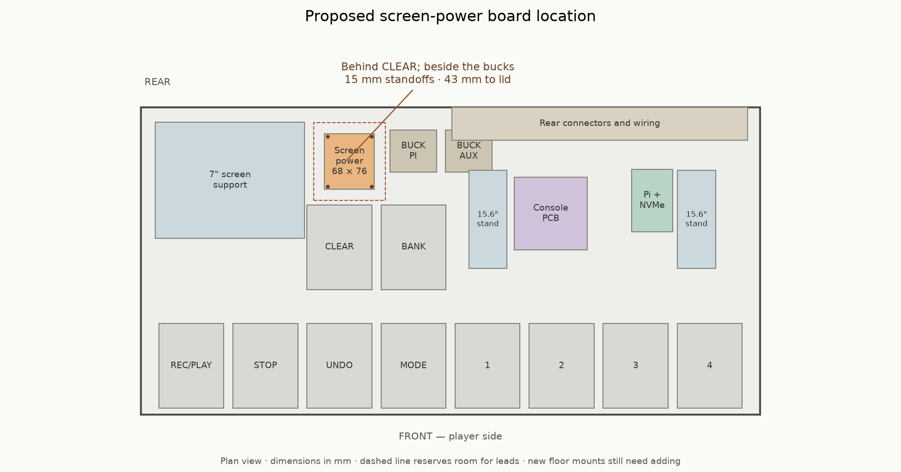

# Screen-power PCB enclosure placement

Checked September 24, 2026 for issue #1072. The populated 68 × 76 mm screen-power
PCB fits on the enclosure floor **behind CLEAR, immediately left of the two buck
converters**, on four 15 mm M3 standoffs with components facing up.

**This is a measured placement proposal. The four new floor mounting holes have
not been added to the enclosure generator, manufacturing drawings or Fusion
assembly.** No PCB outline change is needed for this location.

## Location and mounting

Coordinates use the populated Fusion frame: x runs left to right from the left
floor datum, y runs from front to rear, and z points up. All dimensions are mm;
the floor's upper surface is z = 2. See the
[Fusion coordinate contract](../../../hardware/enclosure/FUSION_MODELS.md).

| Item | Proposed position |
| --- | --- |
| Board outline | x251–319, y307–383 |
| PCB underside | z17, on 15 mm standoffs |
| Four M3 mount centres | (255,311), (315,311), (255,379), (315,379) |
| Mount pattern | 60 × 68 |
| KiCad STEP placement | Translation (251,383,17), no rotation |

The STEP uses negative y for positive KiCad board y. Its components remain up;
the AUX input is near the rear-right corner, toward the buck pair. Vertical
connectors remain accessible from above when the lid is removed. The board
already has four 3.5 mm unplated mounting holes; use matching M3 standoffs when
adding the floor fixings.

## Checked clearance

The calculation uses the actual populated screen-power STEP, including the
power transistors, connector bodies and long untrimmed component leads. It checks exported
screen supports and all ten pedal collars, with conservative box envelopes for
the other electronics. None of these objects intersects the proposed board.

| Clearance | Minimum |
| --- | ---: |
| Board front edge to CLEAR platform | 21.2 mm |
| Board left edge to 7-inch tower's outer flange | 27.2 mm |
| Board right edge to BUCK_PI envelope | 21.2 mm |
| Highest populated component to lid | 43.1 mm |
| Longest untrimmed lead to metal floor | 6.9 mm |

The complete board model reaches z37.39. The lid underside is at least z80.47
above its footprint. A working allowance of 15 mm around the PCB and 25 mm above
the highest component leaves space for plugs and wire bends. These allowances
are planning envelopes, not measurements of the purchased cable harness.

This position is clear of the floor vents and the rear connector field. The
board's M3 mounting holes need new floor fixings; none coincides with an existing
screen-support or electronics mounting station. Route the short AUX feed from
the adjacent buck pair and the screen/control leads through the open rear bay.

## Evidence and limits

The [measurement record](screen-power-placement.json) contains every checked
object's bounds and distance, all intersection results, placement assumptions,
and SHA-256 hashes of the source files. Measurements used CadQuery 2.8.0 and
OpenCascade STEP solids.

Sources are the current
[enclosure generator](../../../hardware/enclosure/segno_enclosure.py), the
exported 7-inch tower, both 15.6-inch stands and front/mid pedal collars under
`hardware/enclosure/out/`, plus the
[populated board STEP](../../../hardware/kicad/screen_power/hand/fabrication/board.step).
The lid plane follows the documented canonical Fusion transform. The tower's
translation follows its six existing floor-anchor stations.

Live Fusion was unavailable for inspection, so this does not certify the current
cloud assembly or an installed harness. Cable plugs and bend radii use the
allowances above; screen-support dimensions follow the current project model.
Adding the floor mounts and board occurrence remains enclosure integration work,
separate from fabricating the PCB.
