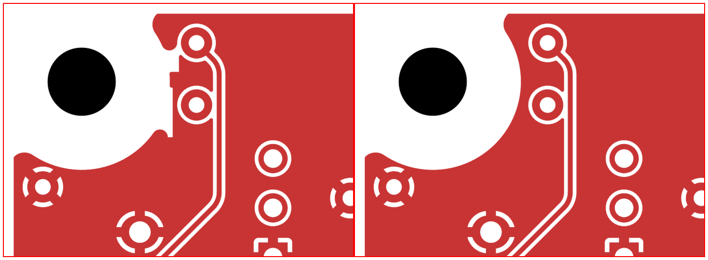

# Revision P: H1 ground-contour cleanup

September 28, 2026. Issue #1072; PR #1080. Baseline:
`bd6456f8efa12418d267a5108e6c70362c746882` (Revision O).
**Review complete: no unresolved actionable finding for the production
identities below.** Strict release validation and independent source/export
review are complete; delivery publication binds these identities to its commit.

## Change and cause

Two obsolete front-copper fill exclusions beside mounting hole H1 cut notches
into the rounded ground boundary after an earlier control-route move.
Claude removed the two named exclusions and their generator function, then
refilled the board. The existing washer clearance, rounded ground outline,
all traces, vias, pads, placements and electrical connections remain intact.
Revision titles and the underside revision label now identify P; schematic
page metadata matches the generator.

## Verification

The [geometry comparison](geometry-preservation.json) covers all 1,313 track
and via items, all 46 footprints and their pads: unchanged from Revision O.
Only the two obsolete fill exclusions are removed. The
[filled-copper comparison](ground-copper-delta.json) finds approximately
1.806 mm² of front ground added locally beside H1; the rear copper is unchanged.

| Final check | Result |
| --- | --- |
| Native ERC and DRC | Zero errors, warnings, exclusions or unconnected items |
| Deliberate fault controls | 123/123 passed |
| Screen fabrication comparison | 415 assertions passed |
| Unchanged console/ring native and fabrication comparison | 175 assertions passed |
| Copper model, nominal | 13.15–13.65 mV at the two mesh resolutions |
| Copper model, conservative material case | 15.93 mV, below the retained 20 mV allowance |

The strict release copy uses the tracked project rules. The unrelated local
project-settings override remains untouched and is excluded from release inputs.
Both checks and exported files use the final Revision P metadata. Updated
README and cost documents include the verified current Mouser cart.

Evidence: [native checks](screen-native-validation.json),
[screen fabrication](screen-fabrication-verification.json),
[console/ring fabrication](console-ring-fabrication-verification.json),
[nominal copper](ground-return-nominal.json) and
[conservative copper](ground-return-stress.json).

The complete
[Revision O review](../screen-power-xh5-1072/review.md) is retained for unchanged
circuit and connector scope; this report does not claim a new full review of
all unchanged design material.

## Production identities

| Item | SHA-256 |
| --- | --- |
| Screen Rev P board | `d0d780a1cde8b70a55f7a60d444e36e02d50835875ba9150b0745ff1b8c3b1ea` |
| Screen Rev P Gerber ZIP | `86ab30459649b32f33347505e43a3e0e8d38ab18313b70ffbd1fa4f983fefe43` |

The [manufacturing manifest](../pcb-finish-all-three-1072/manufacturing-zips.json)
selects Revision P and records Revision O as superseded. Console and ring
board/archive identities remain unchanged. These three archives are accepted
as reviewed bare-board fabrication data within the boundaries below.

## Independent review and retained coverage

Claude successfully completed the bounded H1 repair. That authoring run is not
an independent approval. The [separate repair review](raw/independent-repair.md)
checked the removed behavior, remaining washer protection, resulting copper,
source regeneration, architecture, conventions, simplicity and test quality.
The [final closeout](raw/independent-closeout.md) checks revision metadata,
all production sources and exports, procurement evidence and the publisher;
its [machine results](independent-checks.json) bind the final native identities.
No actionable findings remain. The coordinator also inspected the final
populated top and bottom renders and the H1 comparison.

The [bug-focused gate](../../code-review/screen-power-ground-cleanup-1072/review.md)
records the current delta and retained prior scope. Complete earlier Claude
and DeepSeek circuit reviews remain applicable only to verified unchanged
material. No new full-board Claude or DeepSeek adversarial approval is claimed.
The new revision changes the local ground contour and revision metadata;
console, ring, circuit, BOM, USB routing and firmware remain unchanged.

## Harness and procurement

The owner confirmed that the available cables physically reach. That closes
the earlier reach concern without establishing conductor gauge, insulation
diameter, shielding, crimp quality or assembled USB behavior. See the
[current harness status](harness.md).

The [full Mouser quote](mouser-live-quote.json) records all 55 lines / 192 units
available to ship at the check, at $69.81 parts plus $9.94 estimated tariffs.
The [matching cart](mouser-cart-verification.json) adds $8.49 selected UPS
Ground shipping, totaling $88.24 before tax. Final address and tax are not
entered; stock is not reserved, dispatch timing is not guaranteed and no
purchase was made. The [observed cart rows](mouser-cart-lines.json) match the
quote and the independently reopened shared cart.

## Remaining boundaries

Bare-board design and CAM verification remain distinct from assembled USB
qualification, temperature, shutdown behavior, relay endurance and completed
enclosure service access. Full current-head CI remains pending on the stacked
feature base. No order, merge, flash or deployment is part of this change.
