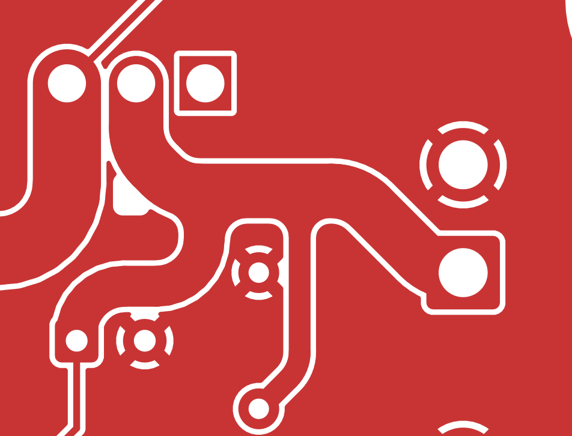

<!-- cspell:words kicad -->

# Revision L AUX input copper review

**Historical checkpoint — superseded artwork.** The [all-three-board audit](../pcb-finish-all-three-1072/audit.md) and its [archive manifest](../pcb-finish-all-three-1072/manufacturing-zips.json) identify the current rounded boards and exports. The hashes and fabrication counts below describe the earlier checkpoint only. Circuit and power calculations remain applicable where their geometry and components are unchanged.

The rounded AUX input revision passes this bounded native-layout review.
The main input holds 2.0 mm from J1.1 to Q3.2; the local capacitor branches
keep their separate 1.5 mm and 0.8 mm widths. The four branch blends now
meet the traces smoothly in the actual filled copper.

This supplements [the previous layout review](final-layout-review.md) for
the AUX-only change. The unchanged source bridge and switched feed remain
2.5 mm wide. This review covers source and native geometry; the fabrication
export has its separate release checks.

The image is KiCad's native front-copper SVG rendered to PNG, showing the
actual filled zones, tracks, pads and holes without silkscreen overlays.

## Reviewed artifacts

| Artifact | SHA-256 |
| --- | --- |
| Previous native board at `29828131` | `d3577772b4945f93652789e109fd232b479cfc8d119dcb67e499da51d39fa5cf` |
| Final `hand/screen_power_hand.kicad_pcb` | `94ffa2a0ad3d428451798306c24dc087cbdf3e122cecefa7753c840033321a2b` |
| Final `route_critical.py` | `30b5f8ce2b49e073d40773af9e0791a92cdcf0513d1804e4c46b06d9283d0016` |

Paths in the table are relative to `hardware/kicad/screen_power/`.
Claude authored the route and fillet correction in `42f7653c` and
`ffaca8b6`. No placement or routing was changed during this independent
review.

## Geometry and clearances

- The input contains 37 segments at 2.0 mm, with a total length of
  15.967206 mm. All bends use circular chord geometry, with a nominal
  1.0 mm inner radius. There is no input taper or narrower approach.
- C2 retains 19 segments at 1.5 mm; C1 retains 10 at 0.8 mm. Both branches
  turn on curves and join the input through four local `POWER_FILLET`
  overlays. Removing these overlays does not remove any electrical route.
- The closest main-path clearance is 0.290 mm to the adjacent 2.5 mm
  COMMON_SOURCE approach. A second 2.5 mm trace on this face would leave
  only 0.040 mm at the 2.54 mm terminal pitch; 2.0 mm preserves clearance
  while meeting the current planning load.
- The branch clearances to C1.2 and C2.2 ground pads are respectively
  0.350 mm and 0.450 mm, above the 0.200 mm rule.
- J1's 2.7 mm square pad remains visible around the 2.0 mm trace. Its small
  shoulder is the terminal pad, not a change in trace width.

The first fillet revision ended exactly on each branch edge. Its outline
narrowed to zero thickness at tangency, so the 0.05 mm zone-fill minimum
clipped roughly the final quarter millimeter of the fillet and left a
visible tiny step. The corrected polygons extend their hidden closures
0.2 mm inside the existing branch copper. Inspection of the filled native
polygons and the rendered copper confirms that all four exposed curves
now reach their tangent ends. No route width or exposed arc was changed
by that correction.

## Preservation and reproducibility

The native comparison found exactly 13 removed and 66 added AUX segments.
Every non-AUX segment, every via, and all existing 0.25/0.5 mm AUX control
segments are unchanged. Footprints, pads, net assignments, component
models, reference text, board graphics, outline, settings and layer stack
also match the previous board.

A disposable replay of the current routing source reproduced all 66
critical AUX segments within 0.03 micrometers at their endpoints and all
four fillet boundaries within 0.002 micrometers. The small differences are
coordinate conversion precision; both are below the 2 micrometer audit
tolerance. Fillet priorities, clearances and fill settings match exactly.

All 40 USB segments are unchanged. The independent reference-plane check
passes all 5,452 samples. Front and back ground each remain one connected
filled region, and the back ground geometry is unchanged. The source
bridge, switched-feed paths, right-edge bus and mounting-hole clearance
geometry are preserved.

Native DRC reports zero violations, zero unconnected items and zero
schematic-parity findings. The complete board checker passes all 56
controls. No actionable geometry finding remains in this AUX revision.
