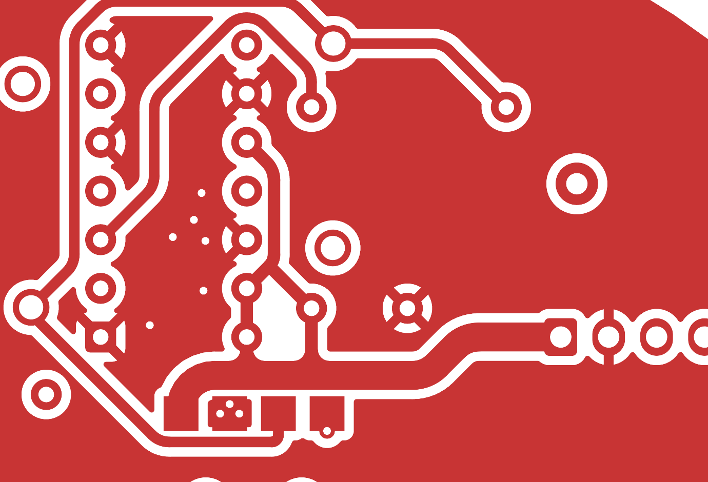
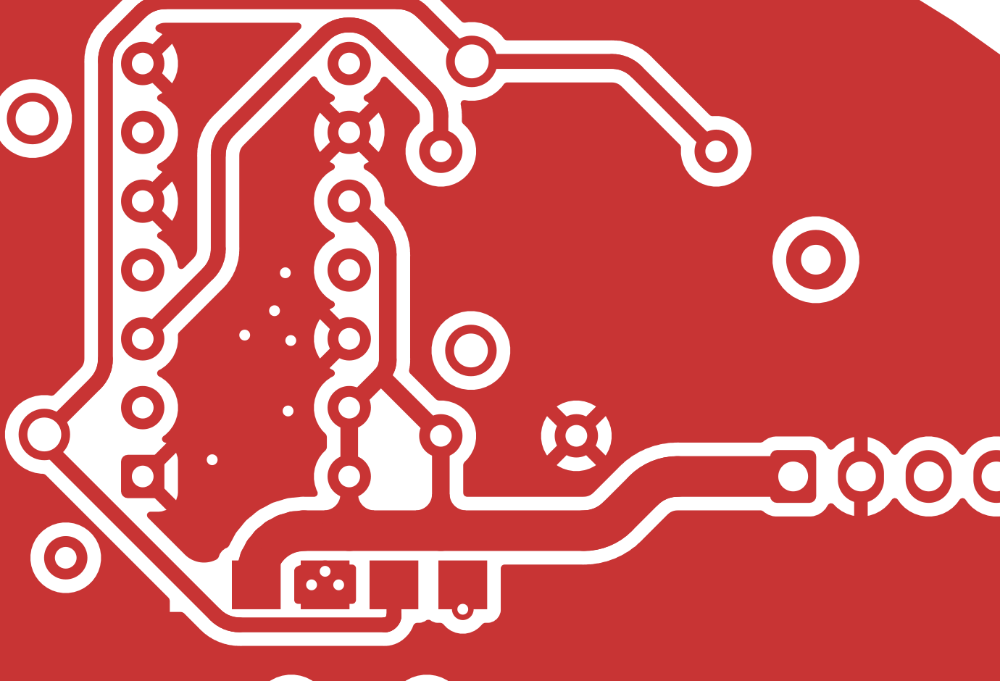
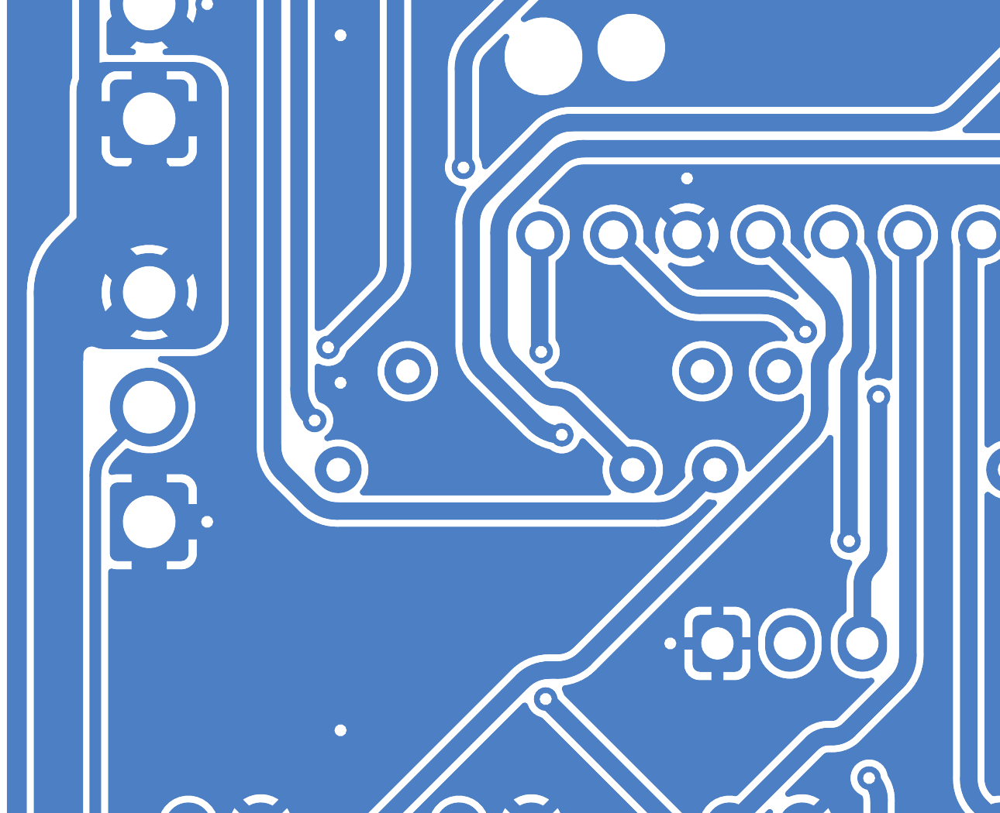

<!-- cspell:words busbar -->
# Console and ring filled-copper audit

28 September 2026, issue #1072. This report covers the console and ring only;
the screen-board author reviews its separate routing change.

Reviewed both copper layers of both boards from KiCad's actual filled-copper
SVG export, including enlarged power junctions, pad exits, via landings and
board edges. This checks the copper that will be plotted, rather than relying
on a clean DRC or the appearance of track centre lines alone.

Two ring front-plane protrusions were removed:

- Beside J2.1, a narrow ground nose ended near (30.79, 23.94) mm. A local
  1 mm tangent-radius cutback now blends the diagonal clearance into the
  power-rail bend and removes the adjacent pad-clearance ledge.
- Northwest of U2.1, a small ground island at x=25.73–27.85,
  y=17.40–19.85 mm connected only through that pad's northwest thermal spoke.
  It contained no other ground pad or via and carried no through return.
  A local zone-only exclusion removes it. The northeast and southeast
  0.5 mm spokes still connect U2.1 to the inner stitched ground plane;
  its back-layer connections are unchanged.

The source finish step in `ring_power.py` installs the same two zone-only
exclusions after routing. Tracks, pads, vias and footprints may still occupy
these areas; only copper fill is excluded. Reapplying the source produces
identical exclusion geometry. No global pour smoothing or trace narrowing
was applied.

The console's prior J24 busbar repair remains smooth. No further actionable
console artifact was found in this pass, so its native file is byte-identical.
Thermal-relief sectors and the ring J2's square wire-solder pads are intentional
geometry and remain present.

Validation:

- Console and ring native DRC: **0 violations, 0 unconnected** on each.
- Ring's **564 track/via items and 73 pads unchanged**, including geometry,
  widths, nets and layers. Back ground contours are identical.
- Only **3.2204 mm²** of front ground fill was removed from the two dead ends.
- Retained ring-power guard passes and rejects all **7** injected faults.
- Encoder fit/filter/thermal guard passes and rejects all **13** injected faults.
- Source/native exclusion geometry, shell syntax and scoped whitespace checks
  pass. This audit does not independently approve the rest of the circuit or
  replace the final fabrication export and review gates.

Native hashes and detailed parity values are in
[geometry-parity.json](copper-finish/geometry-parity.json). DRC evidence:
[console](copper-finish/console-drc.json), [ring](copper-finish/ring-drc.json).

Before and after the two ring fixes:

Unchanged console J24 region:

