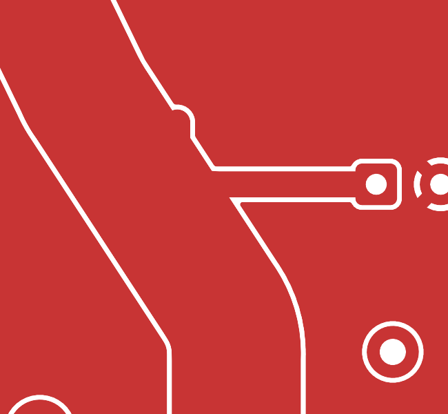

<!-- cspell:words annuli dogleg subpad -->
# Screen power revision N: final copper finish audit

Final native SHA256: `e72850b26ae9076011bc368b69d3f1f1edce758be878bf5fb0decc4f415c5a2f`.

Scope: actual filled F.Cu and B.Cu across the complete 68 × 76 mm screen board, plus native 3D assembly views, followed by electrical, physical and source guards. This is the screen portion of the three-board audit; the console/ring review is separate.

## Repairs

- AUX_5V near C2.1: removed the unnecessary 1 mm track dogleg/nub near (33.6, 14.1). The reservoir tap now runs directly from inside the 5 mm contact feed to C2.1 (41.317621, 16.5); the original checked-width backbone remains. Rounded the two resulting concave junctions near (34.951, 16.0) and (35.606, 17.0) with 0.5 mm tangent copper fills. The analogous coil-branch junction near (25.032, 8.486) received the same treatment. The small locked overlays are named POWER_FILLET; all current-path minimum widths still pass with zones removed.
- SWITCHED_5V near F101.1: removed a redundant 3.5 mm B.Cu extension from (47.04, 23.0) to (47.04, 19.5), which produced a scallop. The underlying rounded incoming path already contains all three transition vias. All three complete annuli remain within at least 3 mm F.Cu and 3.5 mm B.Cu copper, and the independent F101-barrel removal proof still passes.
- Four washer/board-edge intersections: replaced the rectangular ground-zone outline with tangent 0.75 mm end radii adjoining the 4.55 mm clearance arcs. The independent 4.25 mm mounting-hardware exclusion rules remain unchanged.
- H1/control-trace ground tips: after a second independent visual review, cut back both pointed front-ground ends near x8.2–8.6 / y3.0 and y5.5. Two local pour-only rule areas now form 0.4 mm tangent caps meeting the washer contour and existing control clearances. They do not restrict or alter tracks, vias or pads, and leave the rear ground plane intact.
- Backside GPIO17/GND mapping legend: moved to (21, 13), clearing the new driver/support pads without reducing text size or ink-to-mask spacing.

No USB copper, anchor placement, net assignment, board outline, layer count, current-path width or electrical clearance rule was changed by this final finish pass. The small 0.135 mm Q2 sub-pad approach remains under the pad; there is no blanket claim that every microscopic control junction has a large radius. Ordinary thermal-relief gaps and the required fixed USB clearance corridors remain intentional.

## Verification on the final native

- Full `check.py hand --self-test`: CAD ready true, zero errors, 103/103 mutation/control checks pass. Includes circuit/BOM/assembly parity, coil/fuse/gate budgets, three-via full-annulus and barrel-bypass checks, reference-plane sampling, model coverage, and the native silk-mask-gap mutation.
- Native KiCad DRC: zero violations, zero unconnected items, including full severity and track checks. No waivers were introduced.
- Independent pre-redesign USB baseline: all 292 copper items and 18 fixed anchors exactly preserved (the already authorized raw J1.1 net rename remains the sole baseline net-name exception).
- Final `screen_power_hand.kicad_pro` diff versus HEAD is empty. The placed project's design constraints also retain the original explicit minimums; no rule relaxation was used to obtain clean DRC. A temporary probe without its matching project briefly introduced default settings during development; that was detected, restored from the intended project, and all final checks were rerun on the restored settings.
- Earlier full ERC and isolated portable hierarchy ERC were both zero; this finish pass makes no schematic changes.
- Full native copper images were inspected, including corner cutouts, all power branches, vias and thermal interfaces. The final small H1 change was also inspected at close scale. No remaining visually pointed dead-end ground wedge, orphan tail or power-backbone width step was found in this scope.
- The independent sheet-resistance sensitivity model passed on the exact final hash above. Final CAM/package integrity is covered by the separate fabrication report; this copper audit does not substitute for it.

## Evidence

[Final native validation](screen-native-validation.json),
[USB baseline preservation](preserved-usb-final.json), and
[filled-copper voltage assessment](ground-return-assessment.md).

