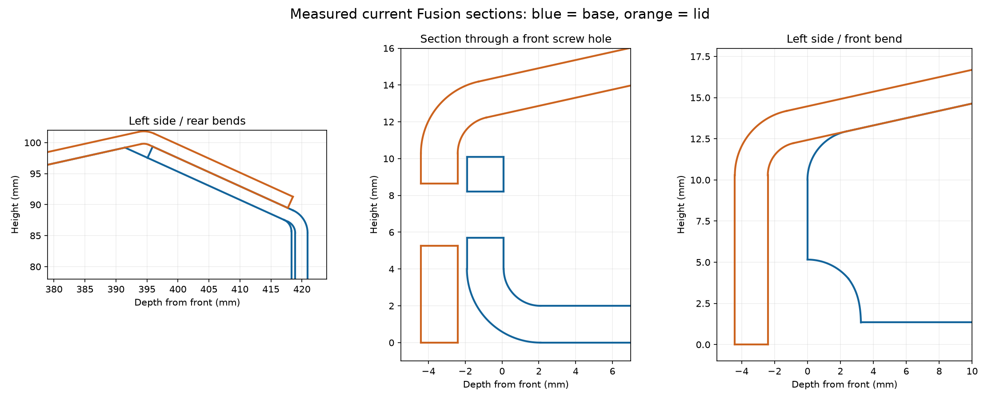

# Seam and front-joint follow-up — 2026-09-05

**Correction verified in source, final files and saved Fusion versions132/345.**
The oversized ridge opening is replaced by a0.30mm nominal normal relief.
One right and one left rear bracket now back the upper straight seam, leaving
about0.22–0.30mm vertical corner relief. All nine front M3 stations now have
solid-metal shim supports, individually fitted after coating to the specified
bare bearing lands. Small forming/coating clearances remain intentional.

The corrected base and both bracket native flats match the source exactly in
both documents. The unchanged lid remains within its0.01mm² parity gate.
All28 manufacturing tests pass; six archives contain90 expected, matching
members. All five updated technical PDFs / ten pages passed visual inspection,
including a corrected paint-cover total/notes overlap.

Both cloud saves completed before a Fusion crash during reopen verification.
After restarting, the saved **VAMP sheet metal132** and **VAMP console
(populated)345** reopened and matched the corrected geometry, placements,
appearances and visibility. The obsolete empty bracket container was removed;
the populated model has423occurrences/973bodies and sheet metal27/27, with no
empty leaf components. All411 other populated occurrences and15 other
sheet-metal occurrences are preserved within1e-8 numeric evaluation tolerance.
The41 existing populated reference-warning rows are unchanged; all manufactured
features remain healthy.

The earlier bracket regeneration changed its stationary leg. The final
occurrence transforms compensate that fold frame and preserve the installed
rivet stations. Each handed bracket is one solid, with zero base/lid
interference. Existing rivet-axis offsets of about0.010–0.011mm remain within
the checked alignment tolerance; do not call them exact mathematical coaxiality.
The front support check also finds no interference with base, lid or actual M3
screw bodies.

No unresolved actionable digital finding remains in this correction scope.
Shop/tooling acceptance and actual component, coating, shim fitting, thread
torque and first-piece load/retention checks remain mandatory before release.
See [current verification](seam-fix-verification.json), [rear review](seam-rear-review.md),
[front proof](seam-front-proof.json), [pipeline review](seam-pipeline-review.md),
and the current [release review](../../../hardware/enclosure/RELEASE_REVIEW.md).
No supplier message or package has been sent.

## Original diagnosis — historical, before correction

The owner's seam observations reopen the manufacturing review. Fresh live
Fusion inspection matches the complete geometry, placements, appearances and
visibility recorded after populated344. No component has moved. The document
has a pending modification flag; this review did not save or discard it.
No CAD geometry or shop archive was changed in this follow-up.

## Confirmed gaps

- The rear side-wall vertical edge is at depth418.300 mm, while the rear-wall
  inside face is at418.910841 mm: **0.610841 mm** bare seam. The source deliberately
  calls for0.5–0.8 mm fit clearance at that edge.
- At the rear ridge, the side-wall contour meets the shortened return flange
  below the curved lid bend. A section through the left wall atX=−0.9 mm shows
  a **roughly2.18 mm vertical opening** near depth395.1 mm. This is distinct
  from the narrow vertical seam; it is not a misplaced component or rendering
  artifact. The sampled section establishes a local opening, not an exact
  global maximum over all views. A closed-looking corner needs a deliberate
  covering/closure detail that preserves bend clearance.
- The front base outside plane is at depth−1.910841 mm; the lid-lip inside plane
  is at−2.410842 mm: **0.500001 mm** bare clearance. This was introduced for
  coated free fit. The documents allow0.15–0.60 mm finished clearance before
  tightening, but no intervening spacer/hard stop is specified at the nine
  front screw stations.

## Unresolved front clamping detail

The M3 head bears on the lid while its thread engages the base. Tightening must
close the intervening gap or load a spacer; clearance-only inspection does not
verify the tightened geometry. The current digital checks prove free fit and
hole registration, not that tightening preserves the lip position or surface
finish. Treat this as an open fastening-design item, not a harmless numerical
residue. Resolve with a dimensioned, supported clamping arrangement (for example,
a fitted hard spacer or revised contact flange) and verify seated/tightened
geometry and removal before release. Do not simply remove all bend clearances
or shift the entire populated lid to conceal the gap.

The earlier clean verdict remains evidence for its recorded checks but is
superseded as an overall manufacturing assessment by these seam findings.
Fabrication release remains on hold. The rear corner's desired visible closure
and the front joint's supported clamping must be resolved explicitly.

Bend relief and seam clearance are separate design controls in the
[Autodesk sheet-metal rule reference](https://help.autodesk.com/cloudhelp/ENU/Fusion-Sheet-Metal/files/SM-RULES-REF.htm).
That general provision does not validate the size or appearance of this design's
opening. Dimensions above come from the current native STEP sections and source.
