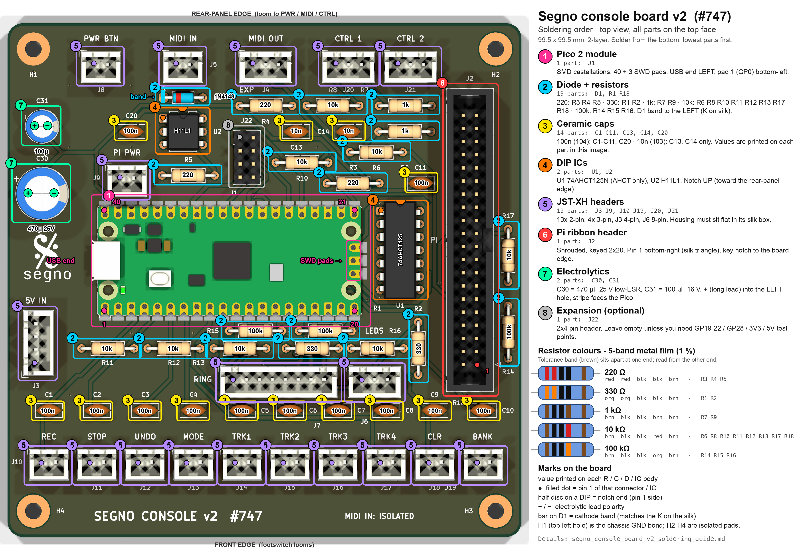

# Segno console board v2 — soldering guide

Hand-assembly walkthrough for the **console board v2** (`hardware/kicad/console_board.py`,
issue #747): the Pico 2 / RP2350 control board that lies beside the Raspberry Pi 5 in the
floor console. Everything on it is through-hole except the Pico 2 module itself, which is
soldered down by its castellations.

The image is the routed board (`kicad/out_console/segno_console_board.kicad_pcb`, DRC
0 / 0) rendered from the top with every part outlined in the colour of its step. Every resistor, capacitor,
diode and IC has its **value printed on its body** in the image, so you can solder straight
from the picture. A filled dot is pin 1, the half-disc on a DIP is its notch, `+`/`−` are
the electrolytic leads, and the bar on D1 is its cathode band.

Sources of truth, in case this page and a file disagree: the netlist generator
`kicad/console_board.py`, the layout generator `kicad/console_board_pcb.py`, the BOM
`kicad/fab/segno_console_board_bom.csv`, and the purchase list
`segno_console_board_v2_lista_compras.txt`. This guide does **not** cover the encoder ring
PCB (`segno_pedal_ring`, see `MANUFACTURING.md` §3) or the V1 pedal board.

---

## 1. Before you pick up the iron

### Tools

| Item | Notes |
|---|---|
| Temperature-controlled iron, chisel or bevel tip ~2 mm | 320–350 °C leaded, 350–370 °C lead-free |
| Solder 0.6–0.8 mm, flux-cored | Plus a flux pen for the Pico castellations |
| Flush cutters, fine tweezers, Kapton or masking tape | Tape holds the Pico flat while tacking |
| Multimeter with diode/continuity mode | Used for sorting and for every check below |
| Isopropyl alcohol + brush | Clean flux off around U2 (the isolation barrier) |
| Optional: DIP-14 + DIP-6 sockets | Not on the BOM; fine to add for U1/U2 |

### Sort the parts with the meter, not the colour bands

The resistors are ¼ W **metal film, 1 %**: blue body, **five bands**. Four bands sit
together (three digits + multiplier) and the fifth, the brown 1 % tolerance band, sits
apart at the other end. Read from the grouped end. The same key is drawn in the image.

| Value | Qty | Refs | 5-band code (digit · digit · digit · multiplier · tolerance) |
|---|---|---|---|
| 220 Ω | 3 | R3, R4, R5 | red · red · black · black · brown |
| 330 Ω | 2 | R1, R2 | orange · orange · black · black · brown |
| 1 kΩ | 2 | R7, R9 | brown · black · black · brown · brown |
| 10 kΩ | 8 | R6, R8, R10, R11, R12, R13, R17, R18 | brown · black · black · red · brown |
| 100 kΩ | 3 | R14, R15, R16 | brown · black · black · orange · brown |

Brown-black-black-*x*-brown is three of the five values; only the fourth band tells 1 k,
10 k and 100 k apart (brown, red, orange). Meter them.

| Capacitor | Qty | Refs | Marking / size |
|---|---|---|---|
| 100 nF ceramic disc, 2.5 mm pitch | 12 | C1–C11, C20 | `104` |
| 10 nF ceramic disc, 2.5 mm pitch | 2 | C13, C14 | `103` |
| 470 µF **25 V low-ESR (≤0.15 Ω)** radial | 1 | C30 | Ø10 mm, 5 mm pitch. A 16 V part is Ø8/3.5 mm and will not fit |
| 100 µF 16 V radial | 1 | C31 | Ø6.3 mm, 2.5 mm pitch |

Semiconductors: U1 **74AHCT125N** (it must be AHCT — HC or HCT will not take a 3.3 V input
reliably), U2 **H11L1**, D1 **1N4148**, and the **Raspberry Pi Pico 2** (non-W).

Connectors: 13× JST-XH 2-pin (J5, J8, J9, J10–J19), 4× JST-XH 3-pin (J4, J7, J20, J21),
1× JST-XH 4-pin (J3), 1× JST-XH 8-pin (J6), 1× shrouded keyed 2×20 IDC header (J2),
and optionally 1× 2×4 pin header (J22).

### Check the bare board

- No visible scratches across the ground pour, no lifted pads, holes all drilled.
- Continuity: `+5V` to `GND` open (J3 pin 1 to pin 2), `+3V3` to `GND` open
  (J2 pin 1 to J2 pin 6). If either reads a short on the bare board, stop.
- Orientation: the silk reads correctly with the **five rear-panel headers
  (PWR BTN, MIDI IN, MIDI OUT, CTRL 1, CTRL 2) along the top edge** and the **ten footswitch
  headers (REC … BANK) along the bottom**. `5V IN` is on the left, `PI` on the right.

---

## 2. Soldering order

All parts go on the **top** (silkscreen) face and are soldered from the bottom, except the
Pico, which is soldered from the top. Lowest parts first so the board still lies flat on
the bench for each step.

### Step 1 — Pico 2 module (J1)

The only surface-mount job on the board, and the one to do first while nothing is in the
way. The module lies flat on the board and its 40 castellated half-holes sit on 40 SMD pads
underneath.

| Check | What you should see |
|---|---|
| Orientation | **USB connector at the LEFT end**, toward the `5V IN` header. |
| Pad 1 (GP0) | Bottom-left corner of the module. Pads 1–20 run left→right along the **bottom** row. |
| Pad 40 (VBUS) | Top-left corner; pads 21–40 run right→left along the **top** row. Pad 39 (VSYS) sits next to it and is the module's 5 V feed from J3. |
| SWD pads | The three `DEBUG` holes at the module's **right** end (SWCLK, GND, SWDIO) sit on the board's pads D1/D2/D3. |

1. Flux the 40 board pads and the 3 SWD pads.
2. Lay the module down and slide it until every castellation is centred on its pad. Tape
   it across the middle.
3. Tack **pad 1** (bottom-left) and **pad 21** (top-right). Re-check alignment along both
   rows; reheat and nudge if any half-hole is off its pad.
4. Solder every castellation: tip touching the board pad and the half-hole together, feed
   a little solder, let it wick up the half-hole. Do the 8 GND pads (3, 8, 13, 18, 23, 28,
   33, 38) last; they sink more heat.
5. The three SWD pads: put the tip into each `DEBUG` hole on the module and feed solder
   until it fills the hole and flows onto the board pad below. These are what the Pi uses
   to reflash the board, so they have to be real joints, not cosmetic ones.
6. Meter, before moving on: pad 39 (VSYS) ↔ J3 pin 1 continuity; pad 2 (GP1) ↔ pad 3
   (GND) **open**; pad 40 (VBUS) ↔ pad 39 **open** (VBUS goes nowhere on this board);
   a quick sweep along each row for bridges between neighbours.

If your Pico 2 has a 3-pin JST-SH debug socket instead of three holes (some later batches
and every "H" variant), the castellations still solder as above and SWD needs three short
wires from that socket to the board's D1/D2/D3 pads.

### Step 2 — D1 and the 18 resistors

Flat axial parts, 10.16 mm lead pitch for the resistors, 7.62 mm for the diode. Bend the
leads at the body, insert, splay slightly, solder, trim.

| Ref | Value | Where | Note |
|---|---|---|---|
| D1 | 1N4148 | Between `MIDI IN` (J5) and U2 | **Cathode band to the LEFT**, on the `K` printed on the silk. It is the reverse clamp across U2's LED. |
| R5 | 220 Ω | Left of U2, below `PI PWR` | MIDI IN series resistor |
| R4 | 220 Ω | Under `MIDI OUT` (J4) | MIDI OUT +5 V leg |
| R3 | 220 Ω | Right of centre, under C13 | MIDI OUT signal leg from U1 gate C |
| R6 | 10 kΩ | Right of R3 | U2 output pull-up to 3V3 |
| R8, R7 | 10 kΩ, 1 kΩ | Under `CTRL 1` | R8 tip pull-up, R7 ring current limit |
| R10, R9 | 10 kΩ, 1 kΩ | Under `CTRL 2` (R10 is lower, R9 right of R6) | Same for CTRL 2 |
| R11, R12, R13 | 10 kΩ | Row under the Pico, left | Encoder A / B / SW pull-ups to 3V3 |
| R1 | 330 Ω | Same row, right of R13 | Ring data series, U1 gate B → J6 pin 5 |
| R18 | 10 kΩ | Same row, right of R1 | Link RX series (Pi → Pico) |
| R15, R16 | 100 kΩ | Just under the Pico's bottom pad row | Ring / indicator data pull-downs |
| R2 | 330 Ω | **North-south**, right of `LEDS` | Indicator data series, U1 gate A → J7 pin 2 |
| R17 | 10 kΩ | **North-south**, right of the ribbon header, upper | Link TX series (Pico → Pi) |
| R14 | 100 kΩ | **North-south**, right of the ribbon header, lower | MIDI TX pull-down (holds MIDI OUT quiet when the Pi is off) |

Resistors have no polarity. R2, R14 and R17 are the only ones that stand rotated 90°;
all are flat against the board.

### Step 3 — 14 ceramic capacitors

2.5 mm pitch discs, no polarity, no lead forming. Seat each one down to the board.

| Refs | Value | Where | Role |
|---|---|---|---|
| C1 … C10 | 100 nF | The row above the ten footswitch headers, one per switch, left→right REC … BANK | Debounce (with the RP2350's internal pull-up) |
| C11 | 100 nF | Right of R9, above U1 | U1 +5 V decoupling |
| C20 | 100 nF | Left of U2 | U2 +3V3 decoupling |
| **C13, C14** | **10 nF** | Under `MIDI OUT` / `CTRL 1`, next to R8 | CTRL 1 / CTRL 2 anti-alias. The only two `103`s on the board. |

### Step 4 — U1 and U2

| Ref | Part | Where | Orientation |
|---|---|---|---|
| U2 | H11L1, DIP-6 | Directly under `MIDI IN`, in its own copper-free pocket | **Notch / pin 1 at the top** (toward the rear-panel edge). Pins 1–3 down the left side. |
| U1 | 74AHCT125N, DIP-14 | Between the Pico's right end and the ribbon header | **Notch / pin 1 at the top.** Pins 1–7 down the left side, 8–14 up the right. |

Both packages have their notch pointing at the rear-panel (top) edge. Solder two diagonal
pins first, check the package is flat and the right way round, then the rest. If you use
sockets, orient the socket's notch the same way and press the IC in after everything else
is done.

U2 is the MIDI isolation barrier: after soldering, clean the flux off around it and D1.
Conductive flux residue across that 2 mm gap defeats the whole point of the opto.

### Step 5 — the 19 JST-XH headers

The pad pattern will not stop a 2-pin or 3-pin header going in backwards, so use the silk:
the printed box is the housing's footprint and a header that is rotated 180° will not sit
flat inside it. Pin 1 of every header is the dot in the image. Solder one pin, press the
housing flat while reheating it, then solder the rest.

| Refs | Size | Silk label | Pin 1 side |
|---|---|---|---|
| J8, J5, J20, J21 | 2/2/3/3-pin | `PWR BTN`, `MIDI IN`, `CTRL 1`, `CTRL 2` (top edge) | Left |
| J4 | 3-pin | `MIDI OUT` (top edge) | Left |
| J9 | 2-pin | `PI PWR`, below J8 | Left |
| J3 | 4-pin | `5V IN`, left edge, vertical | **Bottom** (pins run upward 1→4) |
| J6 | 8-pin | `RING`, under the Pico | Left |
| J7 | 3-pin | `LEDS`, right of J6 | Left |
| J10 … J19 | 2-pin | `REC STOP UNDO MODE TRK1 TRK2 TRK3 TRK4 CLR BANK` (bottom edge) | Left |

### Step 6 — J2, the Pi ribbon header

Shrouded, keyed 2×20 box header on the right edge, silk `PI`.

- **Pin 1 is bottom-right**, marked by the small silk triangle beside R14. Odd pins run up
  the right-hand column, even pins up the left-hand column.
- The shroud's polarising notch faces the board's right edge; the silk outline of the
  shroud shows the notch, so match the plastic to the silk.
- Only 16 of the 40 pins carry anything. Pins 2 and 4 (the Pi's 5 V) are deliberately
  **not connected** on this board and must never be jumpered to `+5V`.

Solder two diagonal corner pins, check it is flat and square, then the other 38. The
ground pins (6, 9, 14, 20, 25, 30, 34, 39) sit in the pour and need a second longer.

### Step 7 — C30 and C31, the electrolytics

The tallest parts, so they go last on the left edge.

| Ref | Value | Where | Polarity |
|---|---|---|---|
| C31 | 100 µF 16 V | Upper-left, under `C31` | **+ (long lead) in the LEFT hole**, the one with the silk `+`. Stripe faces the Pico. |
| C30 | 470 µF 25 V low-ESR | Below C31, under `C30` | Same: **+ left**, stripe toward the Pico. |

Both are across `+5V`/`GND`. Backwards, C30 vents at the first power-up; check the stripe
twice before soldering.

### Step 8 — J22 expansion header (optional)

2×4 pin header labelled `EXP`, right of U2. It carries `+3V3`, `+5V`, GP19–GP22, GP28 and
GND and nothing on the board depends on it. Leave it empty unless you want it — but note
that pins 1 (`+3V3`), 2 (`+5V`) and 8 (`GND`) are the handiest test points on the board,
which is a good reason to fit it on the first unit. Pin 1 is top-left; odd pins are the
left column.

### Mounting holes

H1–H4 are M3 with 6.4 mm plated pads. Nothing to solder. **H1 (top-left, nearest
`PWR BTN`) is the one chassis-ground bond**: it is wired to GND, so its standoff must make
metal contact with the case. H2–H4 are isolated pads; use whatever standoffs you like.

---

## 3. Inspection and meter checks before power

1. Clip every lead flush and look at the bottom under a lamp: each joint a wetted cone,
   no bridges between the C1–C10 row and the J10–J19 row, none along U1/U2, none between
   Pico castellations.
2. Clean flux around U2, D1, R5 and J5.
3. Meter checks (board unpowered, nothing plugged in):

| Between | Expect | Catches |
|---|---|---|
| J3 pin 1 (`+5V`) ↔ J3 pin 2 (`GND`) | Open, or a slowly rising reading (C30 charging) | Bridge on C30/C31/U1/J6/J7, Pico VSYS to GND |
| J3 pin 1 ↔ J3 pin 3 | Short (they are the same rail) | J3 soldered on the wrong pins |
| J2 pin 1 (`+3V3`) ↔ J2 pin 6 (`GND`) | Open | Bridge on C20, U2, the pull-ups |
| J2 pin 2 and pin 4 ↔ anything | Open to `+5V` and `GND` | These must stay unconnected |
| J5 pin 1 and pin 2 ↔ GND | Open (> 1 MΩ) | MIDI IN isolation compromised: bridge or flux across U2 |
| J5 pin 1 ↔ pin 2, diode mode | ~0.6–0.7 V one way (D1), ~1.1–1.3 V the other (U2's LED), through R5 | 0 V either way = bridge on D1/U2 |
| Pico pad 39 ↔ J3 pin 1 | Short | VSYS castellation not wetted |
| Pico pad 40 ↔ pad 39 | Open | VBUS bridged to VSYS |
| J10 pin 1 ↔ Pico pad 4 (GP2) | Short | REC footswitch path; repeat for one or two others if you like |
| J6 pin 5 ↔ U1 pin 6 | ~330 Ω (R1) | Ring data path through the buffer |

---

## 4. First power-up (bench, no Pi)

Keep the Pi out of it until the board has run on its own.

1. **USB only.** Hold BOOTSEL, plug the Pico's USB into a computer. An `RP2350` drive
   appears. VBUS is not connected to the board, but the module's own VSYS feed puts
   ~4.8 V on the `+5V` rail, so U1 and the electrolytics are live; nothing should warm up.
   Drop a `blink` UF2 from `pico-examples` onto the drive and confirm the green LED blinks.
2. **5 V from a bench supply on J3**, USB unplugged, current limit 300 mA: `+5V` on pins
   1 and 3, `GND` on pins 2 and 4. Idle draw is a few tens of mA. Confirm 5 V at J22 pin 2
   (or on C30's `+` lead) and that the blink still runs.
3. **3V3 domain.** With no Pi attached the `+3V3` rail is dead — it comes in over the
   ribbon, not from the Pico. To exercise U2 and the pull-ups on the bench, feed 3.3 V into
   J22 pin 1 (or J2 pin 1) from the supply's second channel, limit 100 mA. Then:
   `MIDI_RX` (J2 pin 10) idles at 3.3 V; driving 5 V through a 220 Ω resistor into J5
   pin 1 (return on pin 2) pulls it to 0 V.
4. **Footswitch path.** With the internal pull-up enabled in firmware, shorting J10 pin 1
   to pin 2 reads GP2 low; release is an RC of a few ms through the 100 nF.
5. **Ribbon.** Only after all of the above: Pi off, ribbon on with pin 1 to pin 1 at both
   ends (both headers have pin 1 at the front/SD-card end by design, so the cable does not
   fold), then power the Pi from its own supply and the board from BUCK_AUX per
   `segno_wiring.md` §2.

Firmware note: the Pico runs `firmware/console_board/`; `firmware/console_board/pedal_link.h`
is the wire-protocol reference. Whatever runs on the Pico
must enable the internal pull-ups on the ten footswitch inputs, the encoder inputs and
the two CTRL tips, or those inputs float (see the notes in `console_board.py`).

---

## 5. Connector pinouts for the looms

| Header | Pin 1 | Pin 2 | Pin 3 | Pin 4 … |
|---|---|---|---|---|
| J3 `5V IN` | +5V | GND | +5V | GND (1/3 and 2/4 are parallel pairs) |
| J4 `MIDI OUT` | DIN pin 5 (via R3) | DIN pin 4 (via R4 from +5V) | DIN pin 2 (shield → GND) | |
| J5 `MIDI IN` | DIN pin 4 | DIN pin 5 | — (pin 2 stays unconnected by MIDI 1.0) | |
| J6 `RING` | +5V | +5V | GND | GND, RING_DATA, ENC_A, ENC_B, ENC_SW |
| J7 `LEDS` | +5V | IND_DATA | GND | |
| J8 `PWR BTN` | button | GND | | |
| J9 `PI PWR` | to the Pi 5's J2 button pad | GND | | (flying lead, not the 40-pin header) |
| J20 / J21 `CTRL` | tip (wiper / switch) | ring (3V3 via 1 kΩ) | sleeve (GND) | |
| J10 … J19 | switch | GND | | one per pedal, REC … BANK |
| J22 `EXP` | +3V3 | +5V | GP19 | GP20, GP21, GP22, GP28, GND |
| J2 `PI` (used pins) | 1, 17 = 3V3 | 6, 9, 14, 20, 25, 30, 34, 39 = GND | 8 = MIDI OUT (Pi TXD), 10 = MIDI IN (Pi RXD) | 24 = link RX (Pi GPIO8), 21 = link TX (Pi GPIO9), 18 = SWCLK, 22 = SWDIO |

---

## 6. Things the design says not to do

- Do not substitute 74HC125 or 74HCT125 for U1.
- Do not add a third wire to J5 or bond the MIDI IN shield anywhere on the board.
- Do not connect J2 pins 2/4 (Pi 5 V) to `+5V`; the two supplies must only share GND and 3V3.
- Do not fit 5 V pull-ups on the ring board's encoder lines; the pull-ups are R11–R13
  here, at 3V3, on purpose.
- Do not power the Pi through this board or this board through the Pi.
- Do not stuff caps or bleeders on H2–H4; only H1 is a chassis bond.
